# Case study: Exploratory *ACE2* analysis using multi-omic web tools

  ### **Table of contents**

* [Introduction](#Introduction)

* [Databases used in this Case Study](#Databases-used-in-this-Case-Study)

* [Step 1: Discovering the *ACE2* gene](#Step-1:-Discovering-the-ACE2-gene)

* [Step 2: searching in Genomic and sequence databases](#Step-2-searching-in-Genomic-and-sequence-databases)

* [Step 3: searching of ACE2 Gene expression](#Step-3-searching-of-ACE2-Gene-expression)

* [Step 4: searching in Cancer databases](#Step-4-searching-in-Cancer-databases)

* [Step 5: Comparative databases](#Step-5-Comparative-databases)

* [Step 6: Alternative splicing databases](#Step-6-Alternative-splicing-databases)

* [Step 7: methylation databases](#Step-7-methylation-databases)

* [Step 8: Regulatory Databases](#Step-8-Regulatory-Databases)

* [Step 9: miRNA, lncRNA and circRNA Databases](#Step-9-miRNA-lncRNA-and-circRNA-Databases)

* [Step 10: Metabolic databases](#Step-10-Metabolic-databases)

* [Step 11: Disease-specific and variant-disease association:](#Step-11-Disease-specific-and-variant-disease-association)

* [Step 12: Proteome databases](#Step-12-Proteome-databases)

* [Step 13: Other databases](#Step-13-Other-databases)

* [Complete list of databases](#Complete-list-of-databases)

## Introduction

 This work is part of the article "Fantastic databases and where to find them." To demonstrate how the tools mentioned above work, we chose a case study on ACE2, the Angiotensin I Converting Enzyme 2, an important enzyme related to  Covid-19 and Severe Acute Respiratory Syndrome.
To evaluate the top tools provided in our study, we explore ACE2 data with the following databases and tools: 

## Databases used in this Case Study

Alternative splicing:
* ASPicDB - <http://srv00.recas.ba.infn.it/ASPicDB/>
* NetGene2 - <http://www.cbs.dtu.dk/services/NetGene2/>

Cancer databases:
* CCLE - <https://portals.broadinstitute.org/ccle>
* TCGA data Portal - <https://www.cancer.gov/>

Comparative databases:
* TISSUES - <https://tissues.jensenlab.org/Search>
* ToppCluster - <https://toppcluster.cchmc.org/>

Disease-specific and variant-disease association:
* MARRVEL - <http://marrvel.org/>
* Varsome - <https://varsome.com/>

Methylation databases:
* BECon - <https://redgar598.shinyapps.io/BECon/>
* DiseaseMeth - <http://bio-bigdata.hrbmu.edu.cn/diseasemeth/>

Gene expression databases:
* ESCAPE - <http://www.maayanlab.net/ESCAPE/>
* GTEX - <https://gtexportal.org/home/>

Genomic and sequence databases
* DisGeNET -  <https://www.disgenet.org/home/>
* Harmonizome - <http://amp.pharm.mssm.edu/Harmonizome/>

LncRNA and miRNA databases
* exoRBase - <http://www.exoRBase.org>
* miRDB - <http://mirdb.org/index.html>
* BONUS: Viral miRNA - <http://alk.ibms.sinica.edu.tw/cgi-bin/miRNA/miRNA.cgi>

Metabolic databases:
* CIDeR - <http://mips.helmholtz-muenchen.de/cider/>
* Human Metabolome Database - <https://hmdb.ca/>

Proteome and protein-protein interaction databases:
* PDID: Protein-Drug Interaction Database - <http://biomine.cs.vcu.edu/servers/PDID/index.php>
* The Proteome Browser - <http://proteomebrowser.org/tpb/home.jspx>

Regulatory Databases:
* Interferome - <http://interferome.its.monash.edu.au/interferome/home.jspx>
* TTSMI - <http://ttsmi.bii.a-star.edu.sg/>

Other databases:
* Semantic Body Browser - <http://sbb.cellfinder.org/>
* VDJdb (COVID-19) - <https://vdjdb.cdr3.net/>

## Step 1: Discovering the *ACE2* gene

First of all, we use OMIM <https://omim.org/> to found more informations abou the *ACE2* gene. 

Using the OMIM database, we found:
  - [x] **Alternative gene name**: (*ACEH*)
  - [X] **HGNC Approved Gene Symbol**: *ACE2*
  - [X] **Cytogenetic location**: Xp22.2
  - [X] **Genomic coordinates** (GRCh38): X:15,518,196-15,602,157 (retrieved from NCBI).

  Also, OMIM provides information about **Cloning and Expression**, **Gene Structure**, **Mapping**, **Gene Function**, **Biochemical Features**, **Molecular Genetics**, **Animal Model** information, and **REFERENCES** related to the gene.

Using GeneCards <https://www.genecards.org/>, we found several topics about the *ACE2* gene:

* Angiotensin I Converting Enzyme 2 and aliases for *ACE2* Gene
* External Ids for ACE2 Gene and Previous GeneCards Identifiers for *ACE2* Gene
* Summaries for *ACE2* Gene: Entrez, GeneCards, UniProtKB/Swiss-Prot, and Gene Wiki Gene Summary for *ACE2* Gene
* Genomics: promoters and enhancers, gene orientation and RefSeq
* Protein information, with antibody and protein products
* Domains
* Molecular function, gene ontology and animal models for *ACE2*
* Related drugs
* Transcripts
* Expression for *ACE2* Gene
* Orthologs, Paralogs, Disorders and Variants for *ACE2* Gene
* Publications, Products and Sources.

## Step 2: searching in Genomic and sequence databases
To obtain more informations about *ACE2* related diseases, we search informations in DisGenet and Harmonizome.
The initial screen of DisgeNet shows three options of input: 1) disease 2) genes 3) variants
We choose the second option: genes to search information about the *ACE2* gene.
The screen shows these options:

* **Entrez Identifier**: 59272
* **Gene Symbol**: *ACE2*
* **Uniprot Accession**: Q9BYF1
* **Full Name**: Angiotensin I converting enzyme 2
* **Protein Class**: Enzyme
* **DPI**: 0.769
* **DSI**: 0.477
* **pLi**: 0.99769

When **DPI** is the Disease Pleotropy index, The DPI ranges from 0 to 1. Example: gene KCNT1 is associated to 39 diseases, 4 disease groups, and 18 phenotypes. 29 out of the 39 diseases have a MeSH disease class. The 29 diseases are associated to 5 different MeSH classes. The DPI index for KCNT1 = 5/29 ~ 0.172. Nevertheless, gene APOE, associated to more than 700 diseases of 27 disease classes has a DPI of 0.931. If the gene/variant has no DPI value, it implies that the gene/variant is associated only to phenotypes, or that the associated diseases do not map to any MeSH classes.

**DSI** is the  Disease Specificity Index, which consists into There are genes (or variants) that are associated wiht multiple diseases (e.g. TNF) while others are associated with a small set of diseases or even to a single disease. The Disease Specificity Index (DSI) is a measure of this property of the genes (and variants). It reflects if a gene (or variant) is associated to several or fewer diseases. he DSI ranges from 0.25 to 1. Example: TNF, associated to more than 1,500 diseases, has a DSI of 0.263, while HCN2 is associated to one disease, with a DSI of 1. If the DSI is empty, it implies that the gene/variant is associated only to phenotypes.

And **pLi** is a GNOMAD <https://gnomad.broadinstitute.org/> metric is the probability of being loss-of-function intolerant, is a gene constraint metric provided by the GNOMAD consortium. A gene constraint metric aims at measuring how the naturally occurring LoF (loss of function) variation has been depleted from a gene by natural selection (in other words, how intolerant is a gene to LoF variation). LoF intolerant genes will have a high pLI value (>=0.9), while LoF tolerant genes will have low pLI values (<=0.1). The LoF variants considered are nonsense and essential splice site variants.

The ouput screen also show more options, such as Summary of Gene-Disease Associations, Evidence for Gene-Disease Associations, Summary of Variant-Disease Associations and Evidences of Variant-Disease Associations. Currently, the database also provides a COVID-19 related search <https://www.disgenet.org/covid/genes/evidences/?gene_id=59272>

In Harmonizome, the ouput of the search for *ACE2* gene generates a list of associated terms, such as **Name**, **Description**, **Synonyms**, **Proteins**, **NCBI Gene ID**, an option to Download the Associations	in a .csv file, **Predicted Functions**, **Co-expressed Genes** , and **Expression in Tissues and Cell Lines**. Figure 1 show the plot of the Tissue Expression option:

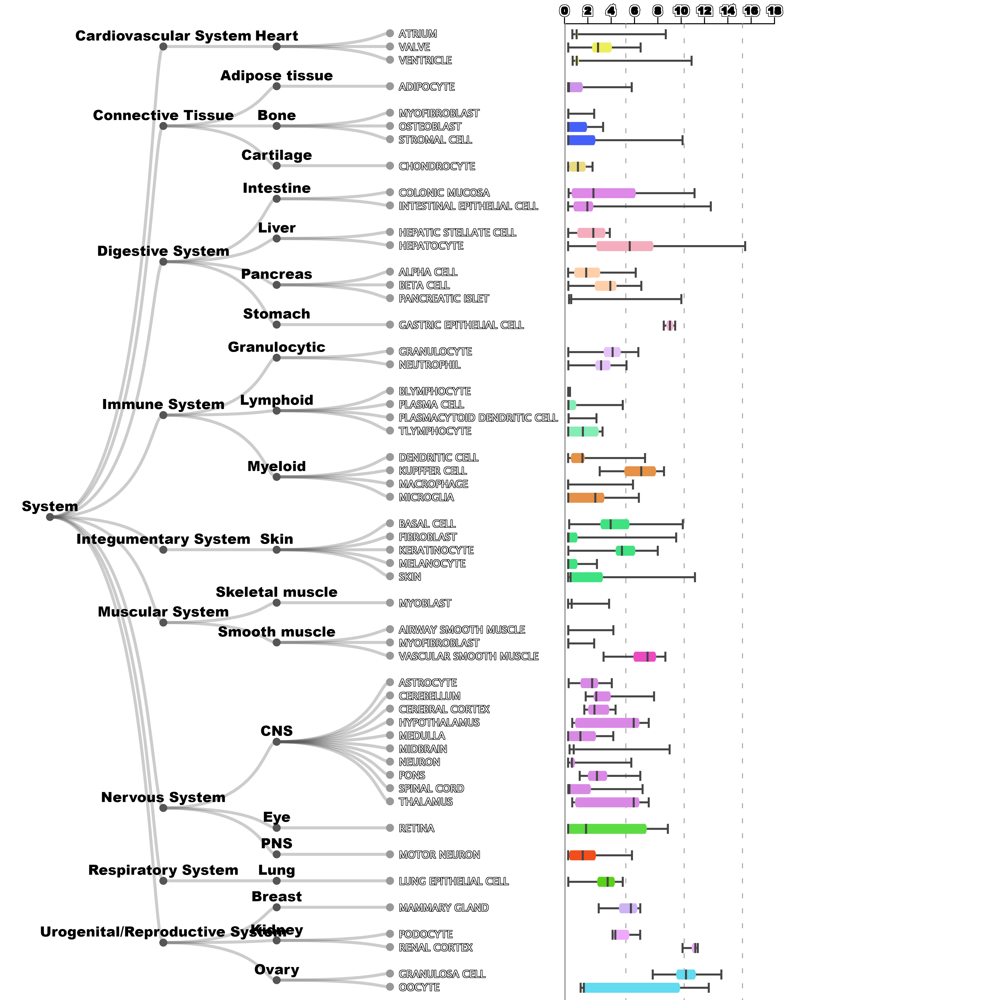

For **Functional Associations**, Harmonizome links up to 30 different resources related to the query gene.

## Step 3: searching of *ACE2* Gene expression

To evaluate the gene expression of *ACE2* gene, we choose two databases: ESCAPE and GTEx portal.
In ESCAPE, we have the options RNAi screens, protein lists from IP-MS pull-downs, genes differentially expressed after knock-down or over-expression, and target genes for transcription factors and histone modifications as determined by ChIP-seq. The input can be gene-lists for overlap with gene lists from the ESCAPE database. On the left, users can cut and paste lists of Entrez gene symbols and then press Submit to perform the enrichment analysis. In the middle, most of the lists from the ESCAPE database are visualized on a canvas. Each square represents a list. The color indicates the experiment type, and the brightness indicates the level of local similarity among the lists. The enriched terms appear as circles on top of the colored squares representing the gene lists from the ESCAPE database on the canvas: the brighter the circle the more significant the overlap with the input list. The results are also available in a table with the associated p-values on the right (Figure 2).

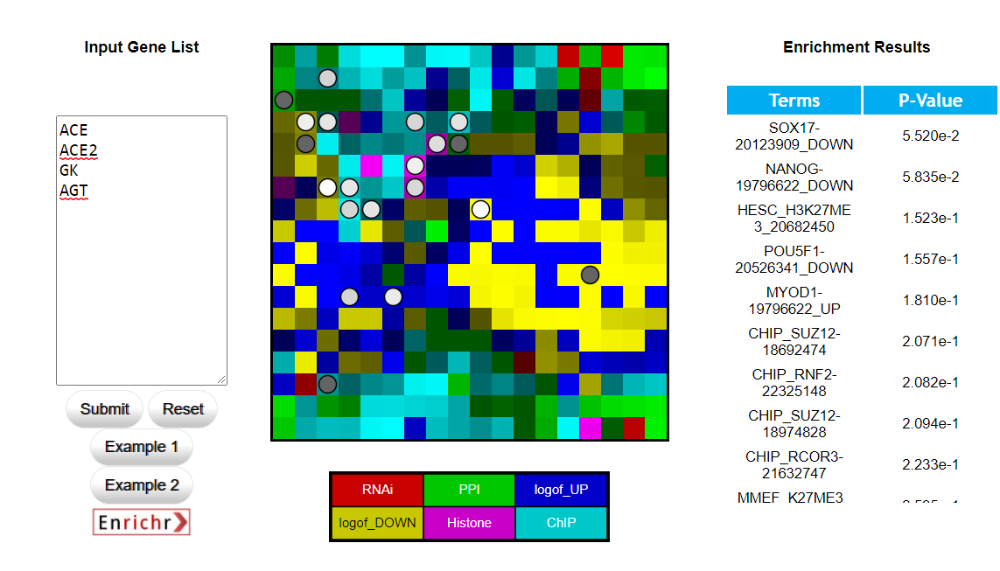 

Additionally, in the bottom of gene list, we found the EnrichR option, which provide gene terms related to Transcription, Pathways, Ontologies, Disease/Drugs, Cell types, and other resources. Figure 3 exemplifies a Pathway result of the gene input generated in ESCAPE:

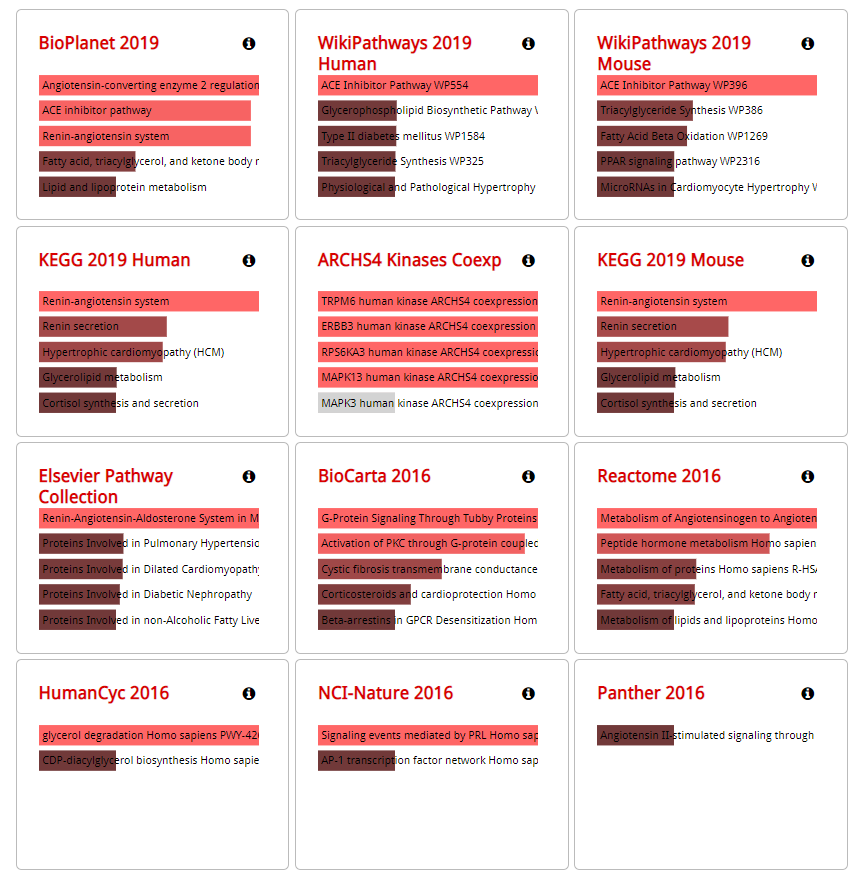 

The Genotype-Tissue Expression (GTEx) project is an ongoing effort to build a comprehensive public resource to study tissue-specific gene expression and regulation. Samples were collected from 54 non-diseased tissue sites across nearly 1000 individuals, primarily for molecular assays including WGS, WES, and RNA-Seq. Remaining samples are available from the GTEx Biobank. The GTEx Portal provides open access to data including gene expression, QTLs, and histology images.

The initial screen show several options for input data:
* **Browse**  By gene ID - Browse and search all data by gene
              By variant or rs ID - Browse and search all data by variant
              
* **By Tissue** - 	Browse and search all data by tissue
* **Histology Image Viewer**	- Browse and search GTEx histology images
* **Expression** 
              Multi-Gene Query - Browse and search expression by gene and tissue
              Top 50 Expressed Genes - Visualize the top 50 expressed genes in each tissue
              Transcript Browser	Visualize transcript expression and isoform structures
* **QTL**
              Locus Browser	Visualize QTLs by gene in the Locus Browser
              Locus Browser - Visualize QTLs by variant in the Locus Browser VC (Variant Centric)
              IGV Browser	 - Visualize tissue-specific eQTLs and coverage data in the IGV Browser
              eQTL Dashboard	- Batch query eQTLs by gene and tissue
              eQTL Calculator	- Test your own eQTLs
* **eGTEx**
              H3K27ac	Browse - H3K27ac ChIP-seq data in IGV Browser
* **Biobank**
              Access Biospecimens	Search and request available GTEx biospecimens

In the option "Browse By gene ID", we can visualize the expression of *ACE2* across more than 30 tissues (Figure 4) 

 

We also visualize the Exon Expression of *ACE2*:

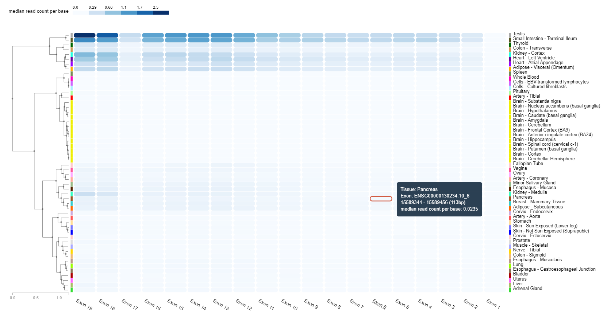 
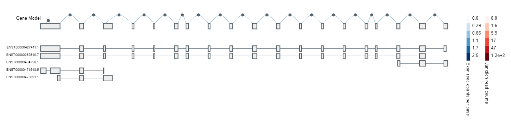 

In the **Expression** - Multi-Gene Query - the input as a gene list, we chose compare the expression of the *ACE* and *ACE2* genes:
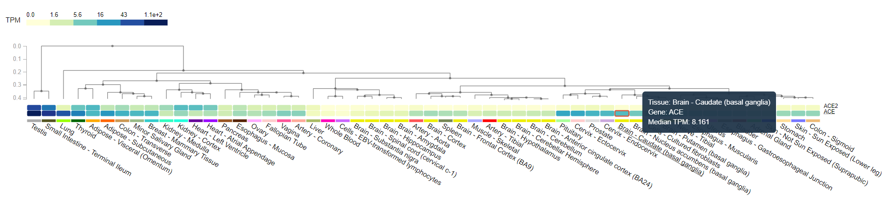 

## Step 4: searching in Cancer databases

To evaluate the expression pattern of *ACE2* in cancer cell lines, we used CCLE - Cancer Cell Line Encyclopedia. The aims of the database were to characterize of a large panel of human cancer models, to develop integrated computational analyses that link distinct pharmacologic vulnerabilities to genomic patterns and to translate cell line integrative genomics integrative genomics into cancer patient stratification.
When search by *ACE2*, the database screen show the Entrez ID (59272), the description (angiotensin I converting enzyme 2), and several external Links. Below, the interactive plot shows the distribution by lineage (RNA-seq expression) and the option to download the data (figure 5)       
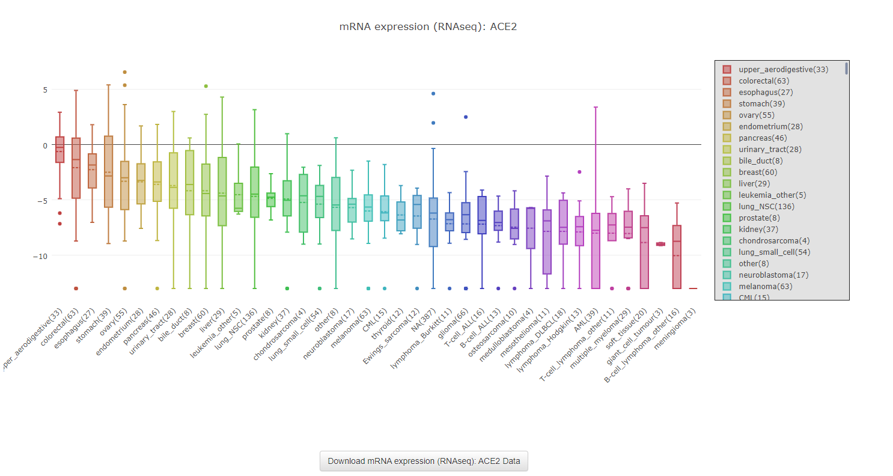

Other options are: scatter plots of the query gene, with the option to compare with other differentially expressed genes across the available datasets, mutation data (users with previously login only), Fusions/Translocations data, and methylation - CpG viewer.

In order to compare the cell line information with clinical data, we chose the TCGA data portal (via GDC data portal, <https://portal.gdc.cancer.gov/>).
Here we can been search for a specific gene, Cases by Major Primary Site, or for a specific barcode (e.g., TCGA-56-7731, primary site: Bronchus and lung).
The search by *ACE2* showed the Gene Summary, External References,  Cancer Distribution of Single Nucleotide Variants (SNV) and Copy Number Variation (CNV), functional impact of the variants with the option to trade the gene transcripts, and the most frequent somatic mutations (figure 6). The user can be download all of these results in tables or figures.
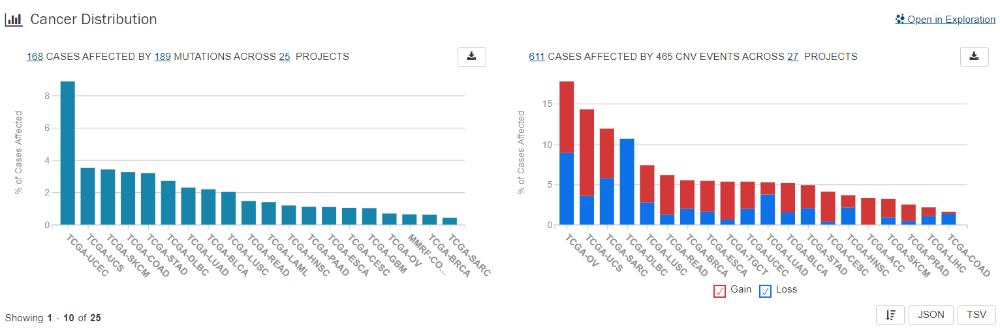
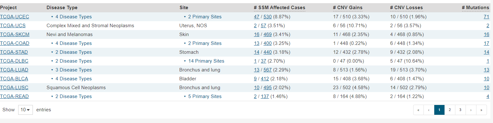
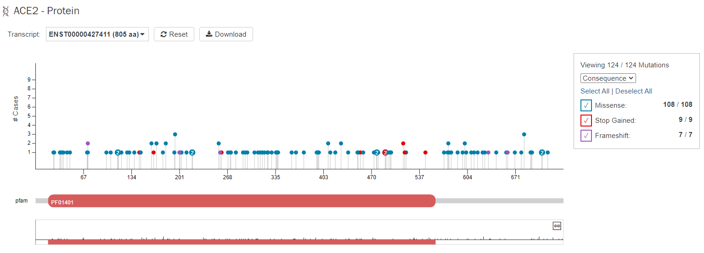
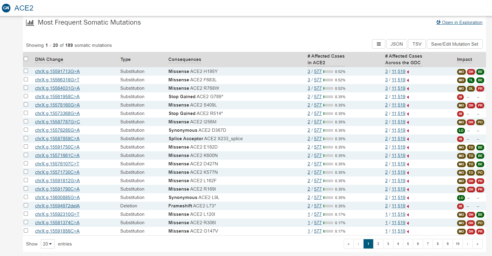
In the exploration menu, we select "TCGA-LUAD" (LUNG ADENOMAS AND ADENOCARCINOMAS) and obtain 37 cases, with clinical and survival data, mutations and oncogrid (figure 7) 
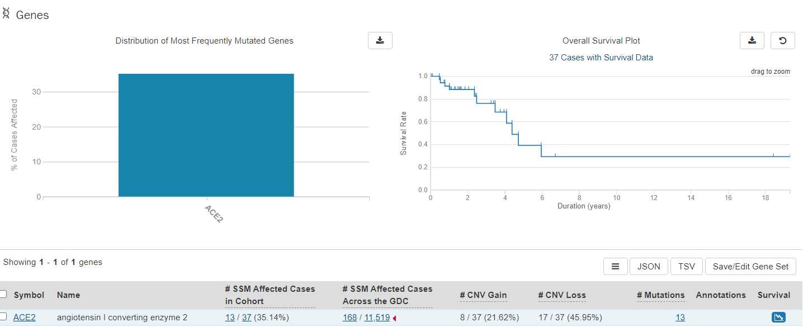
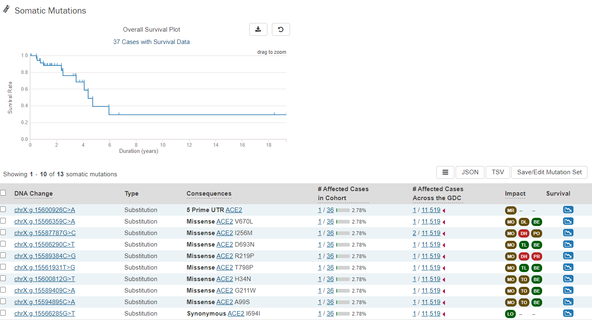
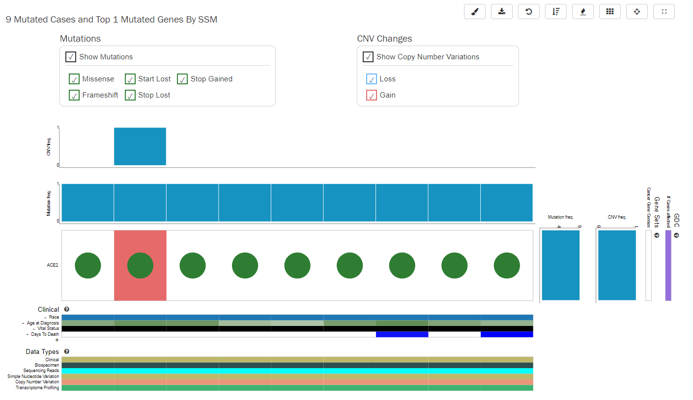

## Step 5: Comparative databases

We used TISSUES database to compare the *ACE2* gene expression across human and animal model data (figure8).
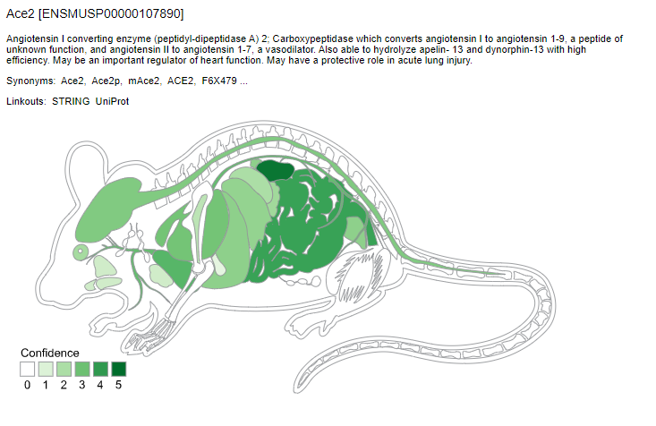
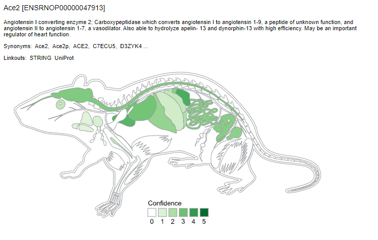
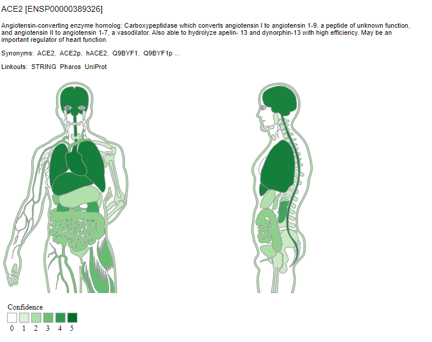
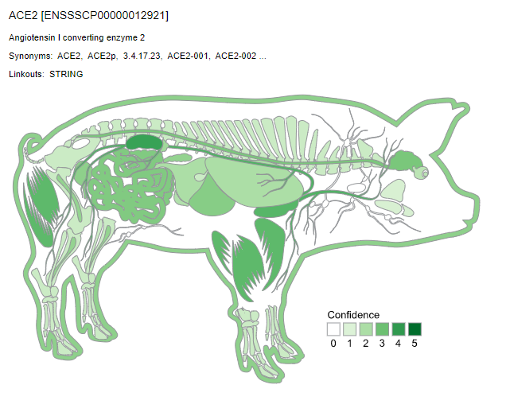

TISSUES also provides experimental curated data, text mining interactions, and orthologs and paralogs. The confidence of each association is signified by stars, where ★★★★★ is the highest confidence and ★☆☆☆☆ is the lowest. 

For the next step, we search a list of genes which interacts with *ACE2* using the GeneMania web <https://genemania.org/>. The search return the following gene list: *ACE2, GK, 
ACE, AGT, CTD-2501B8.1, TMEM27, AGTR2, REN, SULT1E1, RP11-668G10.2, GK2, BDKRB2, EIF4G2, ENPEP, PTP4A3, WEE1, GK5, GHRL, JUND, TUB, SERPIND1, FGGY, CMA1, AQP8* .
We use these gene list with input into TopCluster web server <https://toppcluster.cchmc.org/>. The next step show a feature to explore the data (e.g., gene ontology, drugs, Pubmed, related diseases) and statistical options, such as Correction methods (we choose Bonferroni) and p-value cutoff (0.05). Besides, we may choose start the analysis in the
 Functional Enrichment module or Interaction Network. The database also provide the genes found in the gene list. In our case, 3 genes was not found in the database. We select the top score interactions for run the next step of the analysis. 
 
Note: the quality of the image generated is unclear.

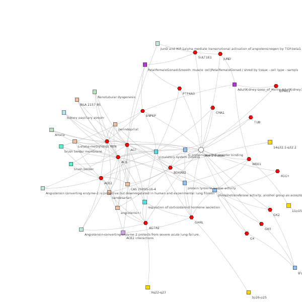

# Step 6: Alternative splicing databases

Here we explore the alternative forms of *ACE2*, first we search in ASPic DB. The gene results can be downloaded and the following output was shown: 
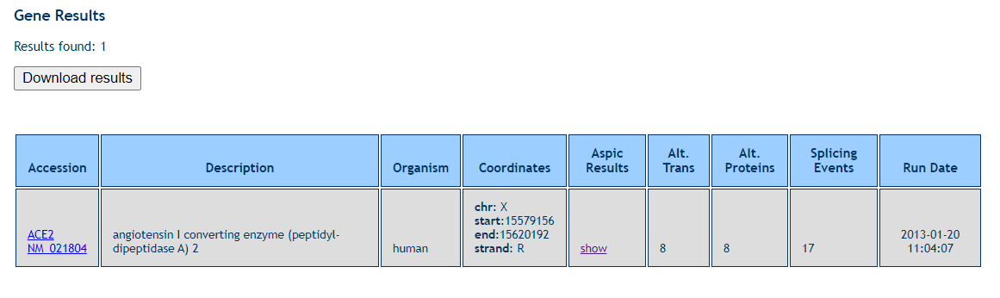

Aspic Results column show the gene information, Gene Structure View, Predicted Transcripts, Transcript Table, Predicted Proteins, Protein Table, Predicted Splice Sites and Intron Table.
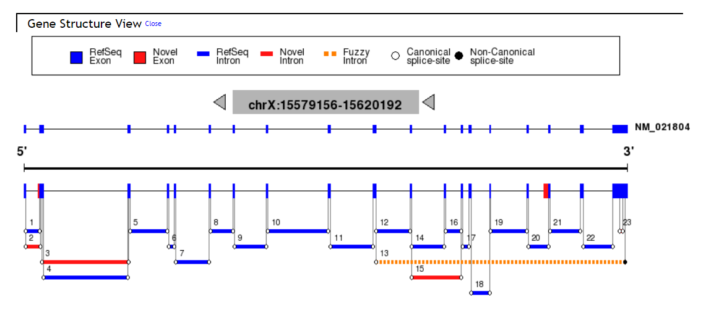
 
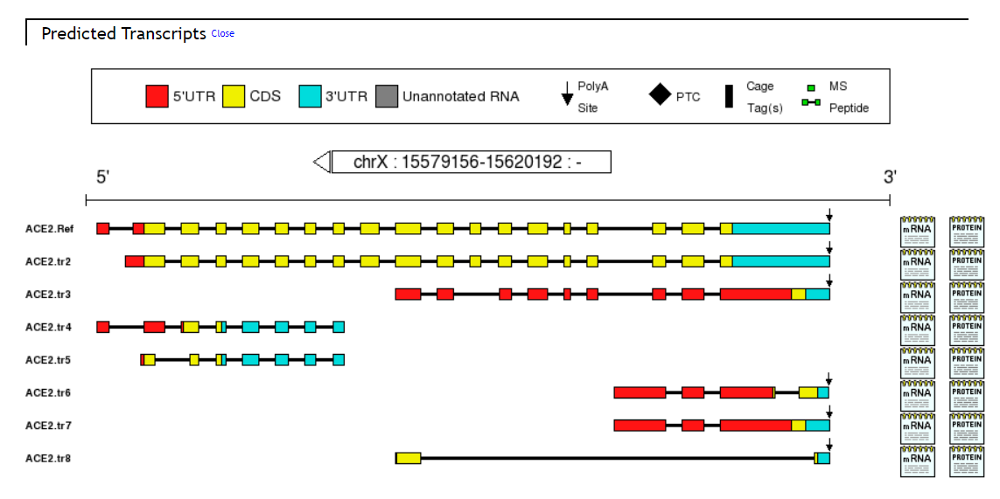

The second alternative splicing database - NetGene2 Server allows the user submit of a local file with a single sequence (.FASTA archive), or submit by pasting a single sequence (.FASTA). The server runs the analysis (stimated time: 2 minutes) with the option "send the results for e-mail". The output was a extended prediction, with several options and results. This may can confuse the user (pay attention!).

********************** NetGene2 v. 2.4 ************************

The sequence: X has the following composition:

Length:	41316 nucleotides.
30.0% A, 19.0% C, 19.5% G, 31.5% T, 0.0% X, 38.4% G+C

Donor splice sites, direct strand
---------------------------------
               pos 5'->3'  phase strand  confidence  5'      exon intron    3'
                    43       2     +        0.00       TCATCGTCAG^GTAGGCCCTT
                   294       2     +        0.67       TTTTGAATAG^GTAAGTGAAG
                  1067       0     +        0.63       GACAGGAGAG^GTAAGGTTCT
                  1524       0     +        0.93       CCAAAACATG^GTGAGTTCTC H
                  2495       1     +        0.64       CTATTTCTTG^GTGAGTTACC
                  2920       1     +        0.37       TCAGACCAGG^GTAATTCTAA
                  3022       0     +        0.46       CTACACACAG^GTACAAGTCG
                  3419       1     +        0.54       GGGCTCCAAG^GTACTGGATA
                  4093       1     +        0.54       TATCTGATAG^GTATGCATGA
                  4165       1     +        0.49       GAGCCCTAGG^GTAAGGATAC
                  4497       1     +        0.60       GTGAAGCCAG^GTAGGGATTG
                  4511       0     +        0.54       GGATTGAGAA^GTGAGTCAGG
                  4520       0     +        0.37       AGTGAGTCAG^GTGGGTTGCA
                  4827       2     +        0.35       CTGAGAGGTT^GTGAGTGTTC
                  5000       2     +        0.54       GGGACTACAG^GTGCGAGCCA
                  5977       0     +        0.44       ATCAAATGAG^GTAAATTATT
                  6395       0     +        0.47       GTCCTTGGAG^GTAAGTCCTA
                  6455       1     +        0.47       AGAGGCTAAG^GTACTTGAGT
                  7405       0     +        0.83       GAGCAAACGG^GTACGTTTGT
                  7545       2     +        0.44       CTATGCCTAG^GTAAGGTGTC
                  8545       0     +        0.44       TGAAATGCAT^GTAAGAGCTT
                  8663       0     +        0.83       TTGTGCCATG^GTAAGGAATT
                 10021       0     +        0.81       CTTGAACCAG^GTAGGCTACT
                 10179       0     +        0.35       GATCAAGTCA^GTAAGTAAGT
                 10183       1     +        0.37       AAGTCAGTAA^GTAAGTCATT
                 10499       2     +        0.31       TATATGAAGA^GTATGTGGTC
                 10537       1     +        0.67       AGAGCAAATC^GTAAGTTTGC
                 12185       1     +        0.31       ATTACCAGGG^GTGAGGTGGA
                 12906       0     +        0.99       CTTTGAAGAG^GTAAGCAAGG H
                 13464       2     +        0.32       AAAAATGGAA^GTAAGACAAA
                 14120       1     +        0.34       AAGGAAGTAG^GTAACAATCT
                 14497       1     +        0.65       CATTTGCTTG^GTAAGAAGCC
                 14600       1     +        0.44       GAAAAATTCT^GTAAGTGGTT
                 14607       2     +        0.41       TCTGTAAGTG^GTTAGTAACA
                 16775       0     +        0.87       GGTGGACCAG^GTAGGAAAAA
                 17028       2     +        0.62       CCATTAAGCG^GTAAGATGTA
                 17266       1     +        0.47       CAAAACACAA^GTAAGTACAT
                 19417       0     +        0.58       CATGCTATAG^GTGAGGAAAC
                 19437       0     +        0.46       TGAGGCTCAG^GTAAATGATT
                 21029       1     +        0.49       GCGACTTCAG^GTAGTGGGGC
                 21447       2     +        0.45       GGTACATGTC^GTAAGAGAGA
                 21745       1     +        0.34       AGAATCCTAG^GTGTGTCACT
                 21780       0     +        0.44       CTTGGACAAG^GTATTTAACT
                 21969       0     +        0.81       AAGGAGGGAG^GTAAGTAAGA
                 22255       1     +        0.37       ATTGACTAGG^GTAGGGATTG
                 22500       0     +        0.54       GAAAGTATAA^GTAAGTTTTC
                 22538       1     +        0.31       ACAGTAGGCG^GTAAATATAT

**The file also continue...**

The results are divided into: Donor splice sites, direct strand, Donor splice sites, complement strand, Acceptor splice sites, direct strand, Acceptor splice sites, complement strand, CUTOFF values used for confidence, and graphical results: 

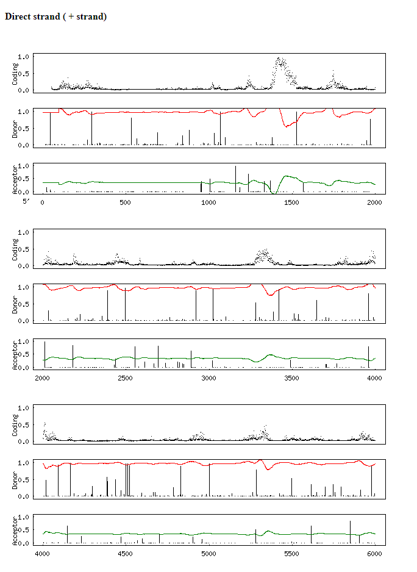

Note: the output - and graphical output was not explained. For more information about the output results, the user can read in the output format page <http://www.cbs.dtu.dk/services/NetGene2/output.php>

## Step 7: methylation databases
To analyze the methylation pattern of *ACE2* gene, we select BECon: A tool for interpreting DNA methylation findings from blood in the context of brain, and DiseaseMeth version 2.0 - The human disease methylation database.

The aim of BECon (Blood-Brain Epigenetic Concordance) is to allow for improved interpretation of surrogate methylation results by looking at the relationship human blood and brain methylation.

Spearman correlation values of methylation between blood and the listed brain region. In these columns colors are used to show the percentile of all correlations each value reaches (see legend). Darker grey and orange represent lower or higher correlations, repetitively. The cell composition metrics are the delta betas between data unadjusted for cell composition and data adjusted for cell composition. So how much the beta values change on average at a CpG with cell composition adjustment.

To acess the methylation pattern of *ACE2* in a cancer context, we used DiseaseMeth. The Search Engine was redesigned into three query entrance: GeneSearch (query DNA methylation level for disease associated genes by disease type), DiseaseSearch (query DNA methylation level across diseases for a specified gene/genomic position), AdvanceSearch (query disease methylome or DNA methylation level for a specified gene/genomic position).

* Disease option is used to select the interested diseases. We select all the cancer types and diseases in order to compare the results.
* Gene name/Transcript ID/Genomic Interval are used to set interested genomic regions. Users can input multiple items. We select *ACE2* only.
* Technology Experimental Platform option is used to select the datatype of methylome. We select all the methylation platforms.
* The option of controls from the same tissue/cellline is used the select all controls from differential researches but the same tissue/cellline. The option of controls from the same research is to select controls in the same research with cases. In some researches, maybe there is no controls matched with cases.
* Method of Differential Analysis: select the method for case-control differential analysis. There are 4 methods including t-test, minfi, samr, edgeR. If t-test is selected, the differential analysis will be applied through Student's t test (we used the default t test).
* Significant p-value is used to set the significant p-value for the analysis. The significant results will be marked with red color in the results panel. The options were 0.01 and 0.05 (we select 0.05).
* Absolute methylation difference: this option is used to filter the differentially methylated region together with the p-value.
* The result will display the outcome of differential analysis, disease-gene association and methlation profile of the given region in the selected diseases. Differential analysis will be applied in the TSS or genomic region by t-test between cases and controls. Survival analysis and functional annotation can also be applied. The Gene-Gene Relationship Analysis and Disease-Disease Relationship Analysis will display the Pearson correlation coefficient between genes or diseases.

Differential methylated results - case vs control : Here we provide 3 examples of the query results:
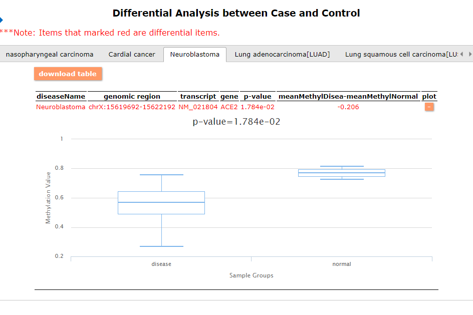
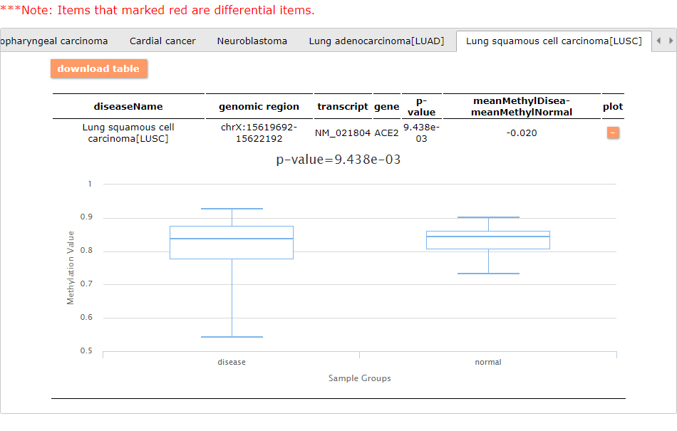
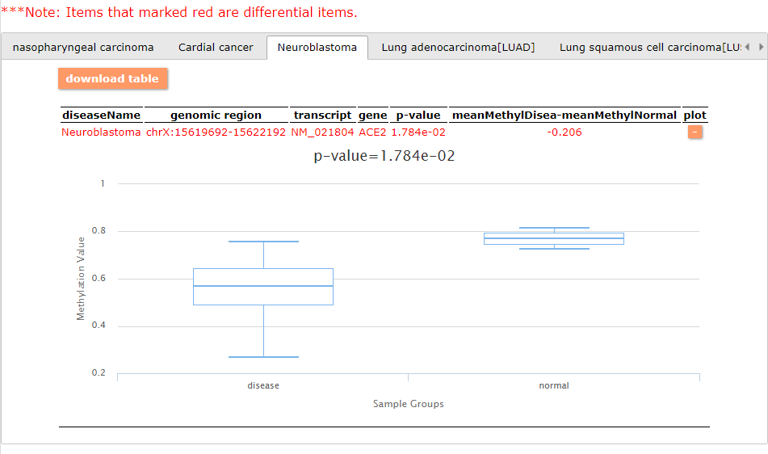

Disease gene association:
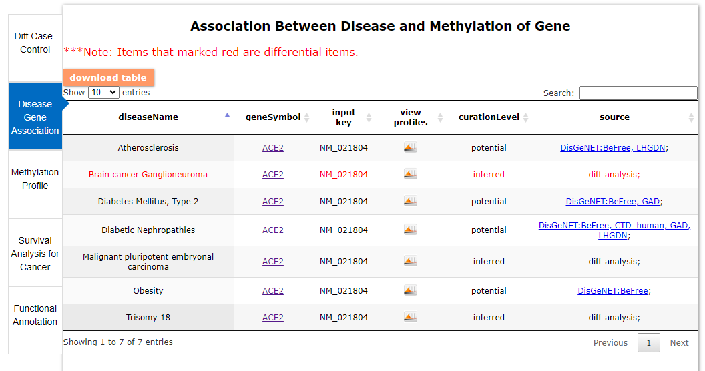

Survival analysis: at this moment, the survival analysis was fail
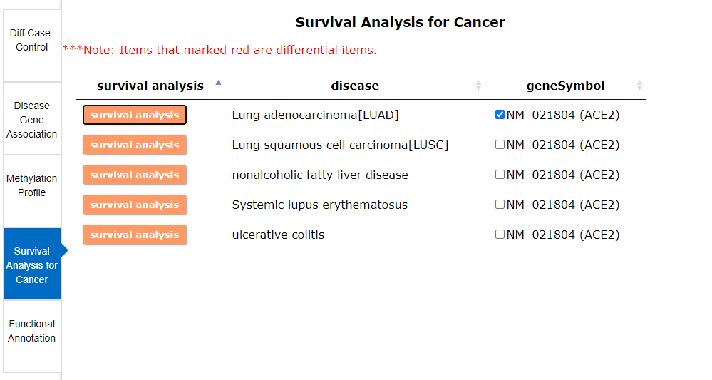
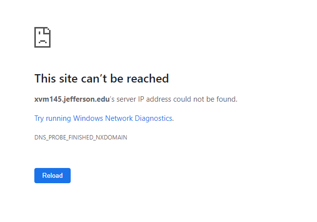

## Step 8: Regulatory Databases
Here we used the Interferome db and TTSMI (Triplex Target DNA Site Mapping and Integration).
The Interferome db - users guide has the link broken (PDF not found). The parameters are: 
* Interferon Type: (ALL) subtype: (ALL)
* Treatment Concentration: Any Treatment Time: Any 
* In Vivo / In Vitro: All Species: ALL
* System:	(Cell or tissues): ALL
* Sample Types:	Any (Normal AND Abnormal)
* Fold Change option - Up: 2.0   Down: 2.0  (The Fold Change value must be greater or equal to 1)
* Gene Symbol List: *ACE, ACE2* 

The output show several options: Search Conditions, Gene Summary, Experiment Data, Ontology Analysis, TF Analysis, Chromosome, IFN Type, and Basal Expression
The Experiment data option:

Transcription Factor provided by TRANSFAC database

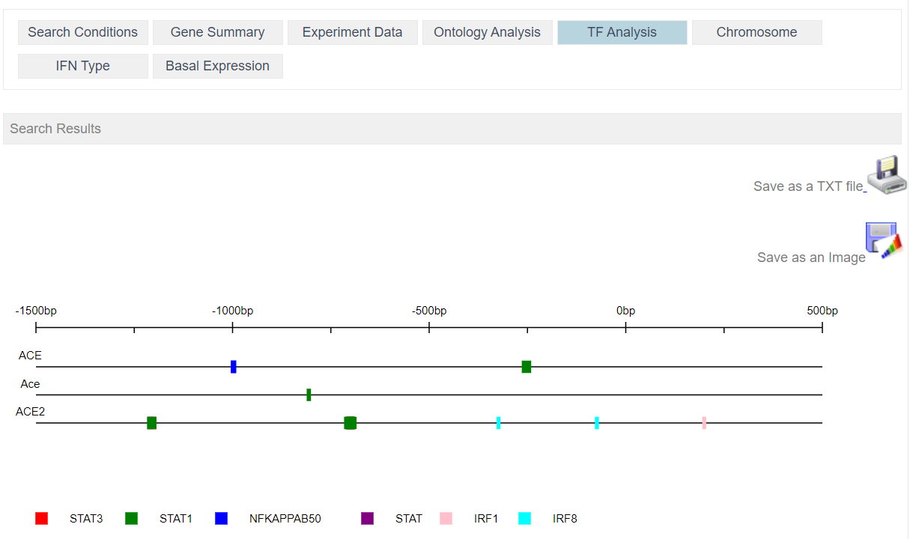

The location of transcription factors on each of the genes from the region spaning -1500bp to + 500 bp from the start site. Each coloured box represents a specific transcription factor, the key for which is provided below the graphic. The user can move the cursor over the transciption factor's coloured box to reveal the TRANSFAC* predicted match between the transcription factor and its predicted binding site.

Interferon type: The Venn diagram shows the number of genes regulated by one or more IFN type (Type I, II or III). It should be noted that there are far more datasets for genes regulated by type I than for types II or III, this imbalance introduces the risk of false nagatives and bias for the under-represented types II and III; caution is therefore encouraged in interpreting low or negative results from these types.

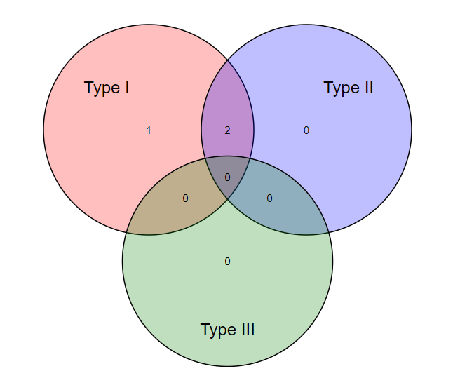

TTSMI (TTS Mapping and Integration) database allows the user to facilitate in (i) searching of the TTS using several search terms including genomic location, gene ID, NCBI RefSeq ID, TTS ID, gene symbol and gene description keywords, (ii) interactive filtering of the TTS co-localized with several other gene regulatory signals, (iii) exploring of dynamic combination of structural and functional annotations of specific TTS, and (iv) viewing of the TTS simultaneously with diverse annotation tracks via UCSC genome browser link. The user can quickly search and filter the TTS candidates from our largest collection of unique TTS location. In terms of finding therapeutic targets, the specificity of TTS is the most important factor to control off-target effects. 

Search by *ACE2* with all default parameters, the website was not return any results.
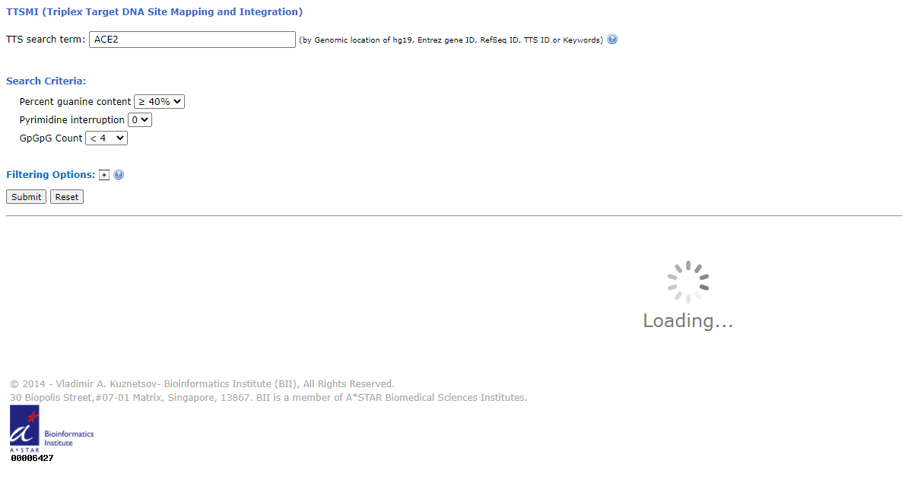

## Step 9: miRNA, lncRNA and circRNA Databases

We used one miRNA database, one lncRNA and circRNA database and one viral miRNA database in order to improve our results.

1) miRNA - miRDB - miRDB is an online database for miRNA target prediction and functional annotations. All the targets in miRDB were predicted by a bioinformatics tool, MirTarget, which was developed by analyzing thousands of miRNA-target interactions from high-throughput sequencing experiments. Common features associated with miRNA binding and target downregulation have been identified and used to predict miRNA targets with machine learning methods. miRDB hosts predicted miRNA targets in five species: human, mouse, rat, dog and chicken. Users may also provide their own sequences for custom target prediction using the updated prediction algorithm. In addition, through combined computational analyses and literature mining, functionally active miRNAs in humans and mice were identified. These miRNAs, as well as associated functional annotations, are presented in the FuncMir Collection in miRDB. As a recent update, miRDB presents the expression profiles of hundreds of cell lines and the user may limit their search for miRNA targets that are expressed in a cell line of interest. The user can choose one of the following search options: Search by miRNA name OR Search by gene target
The initial search returns 50 miRNA candidates to bind the *ACE2* gene:

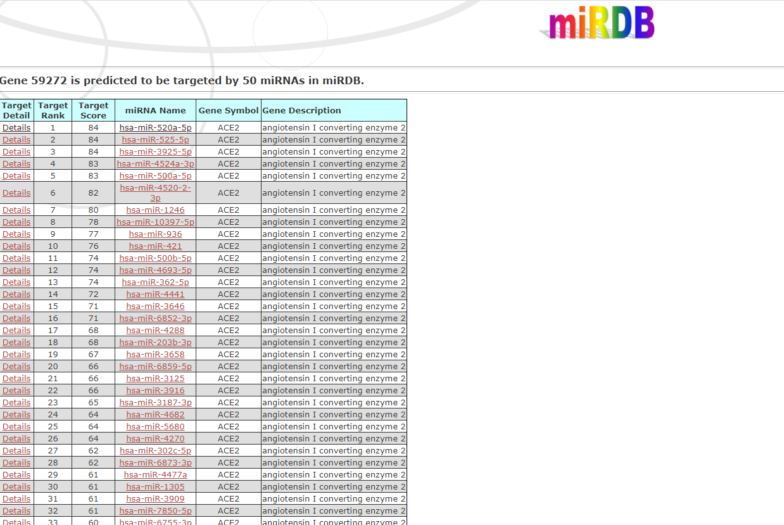

Select the first result, the user can visualize the miRNA target and description:

The user may acess the miRNA information and related references:
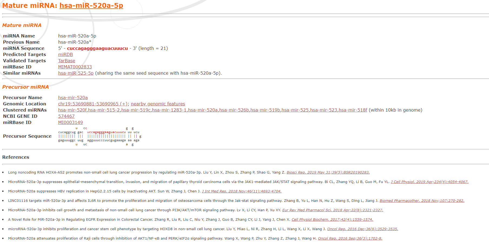

2) lncRNA and circRNA - exoRBase is a repository of circular RNA (circRNA), long non-coding RNA (lncRNA) and messenger RNA (mRNA) derived from RNA-seq data analyses of human blood exosomes. Experimental validations from published literature are also included. exoRBase features the integration and visualization of RNA expression profiles based on normalized RNA-seq data spanning both normal individuals and patients with different diseases.
The user can visualize the data in three different plots: line chart, heatmap and box plot.

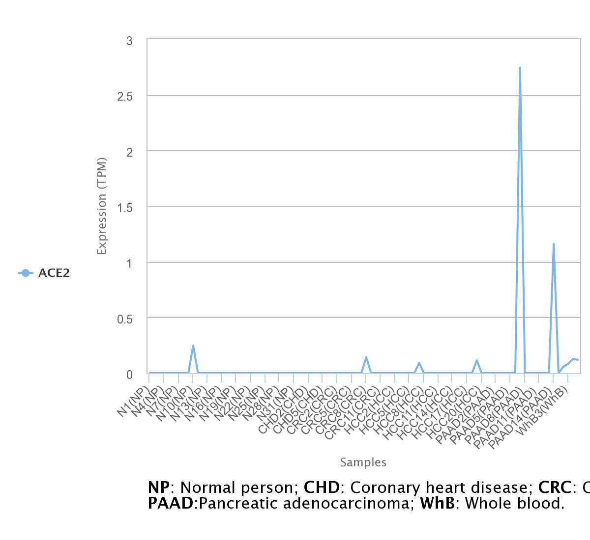
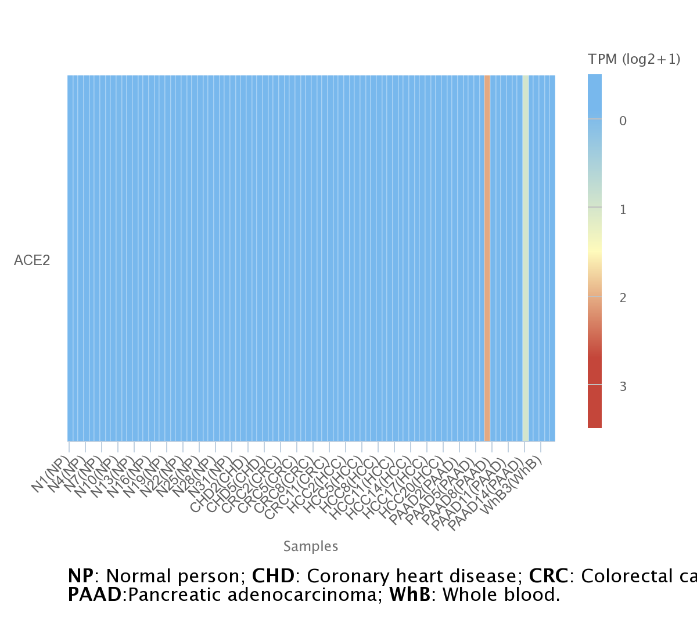

3) Viral miRNA -  VirMir: a database containing predicted viral miRNA candidate hairpins. 
The microRNA hairpin discovery pipeline was also applied to discover viral encoded microRNAs. All viral genomes were obtain from NCBI. The classification of virus is based on the taxonomy table of NCBI (Jun, 2006). Totally, the genomes of 2266 viruses were analyzed. Users may query the putative miRNA hairpins of a specific viral species by the hierarchical menu or by search function using the GenBank Identifier or RefSeq accession number(e.g. 30844336 or NC_003663 for Cowpox virus). In addition, users can also search for the putative target genes of a particular viral miRNA hairpins by a RNAhybrid service link. The 3'-UTR regions of human, mouse, rat, zebrafish, arabidopsis and rice genes are available for search.
Results:
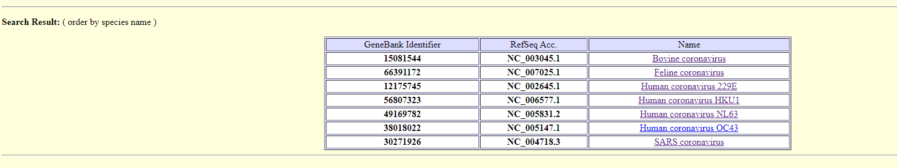

Exploring Human coronavirus OC43 - first result - 22979
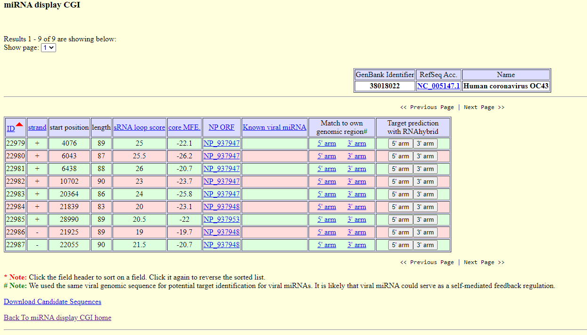

Target prediction with RNAhybrid
For each putative or known miRNA, user may query the target sites in the 3'UTR regions of genes of human, mouse, rat, zebrafish, rice or Arabidopsis. From the human.rna.fna file downloaded from NCBI, we fetched the sequences of human 3'UTRs based on the CDS (coding sequence) positions acquired from the human.rna.gbff file. We adopted the same strategy for the mouse, rat, zebrafish, rice and Arabidopsis 3'UTRs.
In our case, the result send by e-mail was empty, which means there's no matching sequence returned from RNAhybrid.
When operating RNAhybrid, the pipeline first calculates the optimal free energy of miRNA at which it binds to a perfectly complementary site, then the miRNA/mRNA duplex mfe (minimum free energy). An alignment whose RNA duplex mfe is more than the selected percentage of its correspondent optimal free energy is regarded as a positive alignment. The alignment result will be sent to the users via their e-mail addresses.

## Step 10: Metabolic databases

CIDeR is a manually curated database of interactions between disease-related elements such as biomolecules (proteins, metabolites etc.) and other factors (biological processes, phenotypes etc.). The aim of CIDeR is to serve as knowledge base for experimentally-oriented scientists and as resource for bioinformatics applications.
* Per default the search space includes all diseases and all types of data. Queries are not case-sensitive and search all database content that includes the query term (e.g. Mito is sufficient to find everything concerning mitochondria). This type of query is highly unspecific as it includes also information such as gene/protein name synonyms and authors names from referenced literature.
* The first box of the search options (Diseases) allows to restrict the search space for the disease/-s of interest.
* The second box of the search options (Field) allows searching within a specific type of data, e.g. only within genes/proteins, biological processes etc.
* Combined queries can be performed by using Refine query. By clicking on Refine query a second search field is opened. A drop-down menu allows combining the two queries with the Boolean operators AND, OR and NOT.
* The search space can be restricted by setting the search term into double quotes (e.g. "MAPK1" will not find MAPK14 which would happen without quotes)
* CIDer have information about several diseases, like Alzheimer disease, Amyotrophic lateral sclerosis, Autism, Bipolar disorder, COXPD, Cancer, Cardiovascular diseases
Diabetes mellitus (type II), Epilepsy, Farber lipogranulomatosis, Inflammatory bowel disease, Lung disease, Major depressive disorder, Multiple sclerosis, Muscular atrophy
Neutropenia, severe congenital, Other, Parkinson disease, Post-traumatic stress disorder, Postpartum depression, Rare disease, and Schizophrenia.
The result of *ACE2* input are bellow:

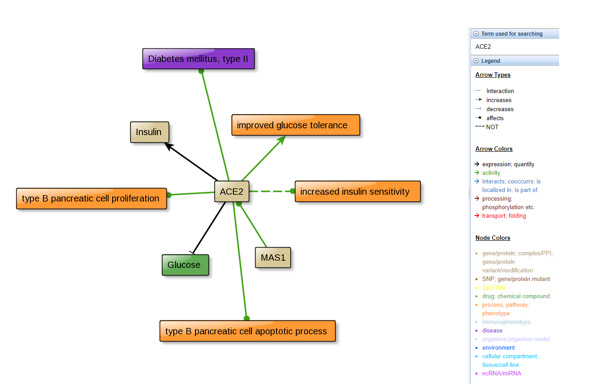

Note: the output only returns diabetes data.

In other hand, HumanMine integrates many types of data for Homo sapiens and Mus musculus. You can run flexible queries, export results and analyse lists of data.
This page lists the data that are included in the current release <https://www.humanmine.org/humanmine/dataCategories.do>. The user can enter names, identifiers or keywords for genes, proteins, pathways, ontology terms, authors, etc. (e.g. eve, PPARG_HUMAN, glycolysis, ACTN2).

The first ouput for *ACE2* was a gene summary, and the user can navigate into several topics: Summary, Function, Genomics, Proteins, SNPs, Disease, Homology, Interactions, Expression, Gene Ontology, Other.

The search return the following error:
---------------------------------
There has been an internal error while processing your request. The problem has been logged and will be investigated. You may also send us an email describing how you encountered this error.
The problem may be temporary in which case you might wish to go back and try your request again or you might want to go to the home page.

For this reason, we used other metabolic database, The Human Metabolome Database. The Human Metabolome Database (HMDB) is a freely available electronic database containing detailed information about small molecule metabolites found in the human body. It is intended to be used for applications in metabolomics, clinical chemistry, biomarker discovery and general education. The database is designed to contain or link three kinds of data: 1) chemical data, 2) clinical data, and 3) molecular biology/biochemistry data. The database contains 114,221 metabolite entries including both water-soluble and lipid soluble metabolites as well as metabolites that would be regarded as either abundant (> 1 uM) or relatively rare (< 1 nM). Additionally, 5,702 protein sequences are linked to these metabolite entries. Each MetaboCard entry contains 130 data fields with 2/3 of the information being devoted to chemical/clinical data and the other 1/3 devoted to enzymatic or biochemical data. Many data fields are hyperlinked to other databases (KEGG, PubChem, MetaCyc, ChEBI, PDB, UniProt, and GenBank) and a variety of structure and pathway viewing applets. The HMDB database supports extensive text, sequence, chemical structure and relational query searches. 

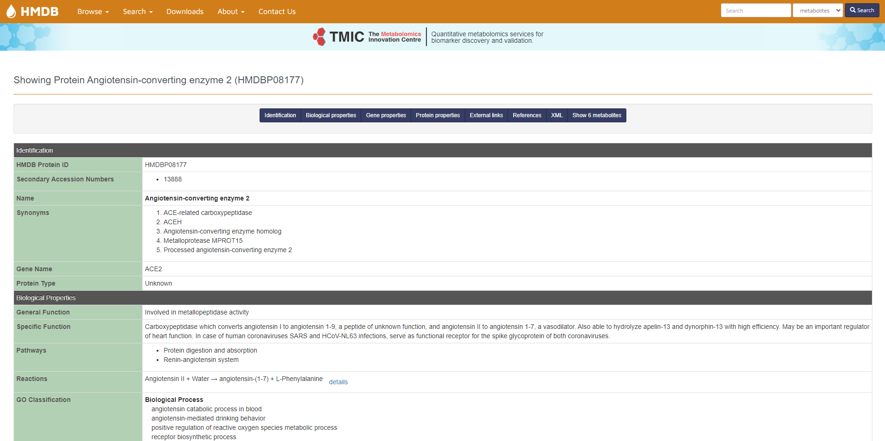

The result can also visualize into SMPDB (The Small Molecule Pathway Database) is an interactive, visual database containing more than 30 000 small molecule pathways found in humans only.

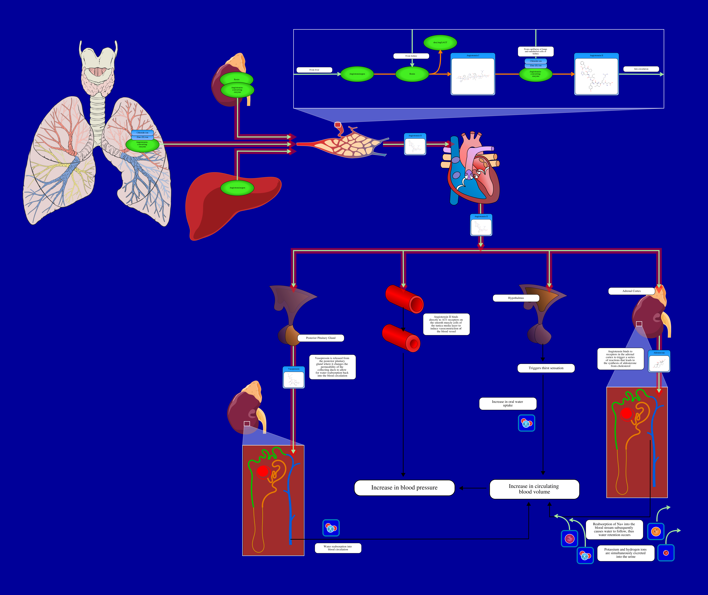

## Step 11: Disease-specific and variant-disease association:

First we search informations about *ACE2* in Varsome - (for more informations, visit the documentation <https://docs.varsome.com/introduction>). 

* Gene basic info
* Region browser
* Structural browser
* Transcripts
* Publications
* Clinical Statistics
* GTEx
* dbNSFP Genes
* GnomAD Genes
* ExAC genes
* Human Phenotype Ontology
* PanelApp
* PharmGKBVarSome (Premium)
* AACT Clinical TrialsVarSome (Premium)
* DGIVarSome (Premium)
* CPICVarSome (Premium)

Here, we we only show results related to variants:
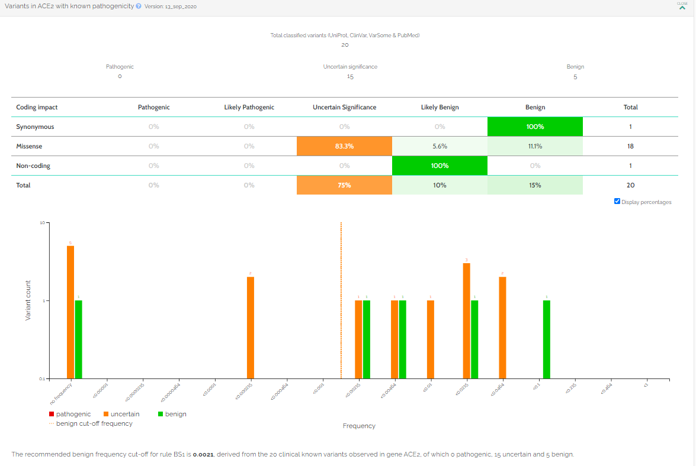

The second database, MARRVEL (Model organism Aggregated Resources for Rare Variant ExpLoration) aims to facilitate the use of public genetic resources to prioritize rare human gene variants for study in model organisms. To facilitate the search process and gather all the data in a simple display we extract data from human data bases (OMIM, ExAC, ClinVar, Geno2MP, DGV, and DECIPHER) for efficient variant prioritization. The protein sequences for eight organisms (S. cerevisiae, S. pombe, C. elegans, D. melanogaster, D. rerio, M. musculus, R. norvegicus, and H. sapiens) are aligned with highlighted protein domain information via collaboration with DIOPT. The key biological and genetic features are then extracted from existing model organism databases (SGD, PomBase, WormBase, FlyBase, ZFIN, MGI, and RGD).

Disease / variant data

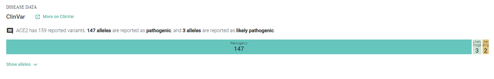
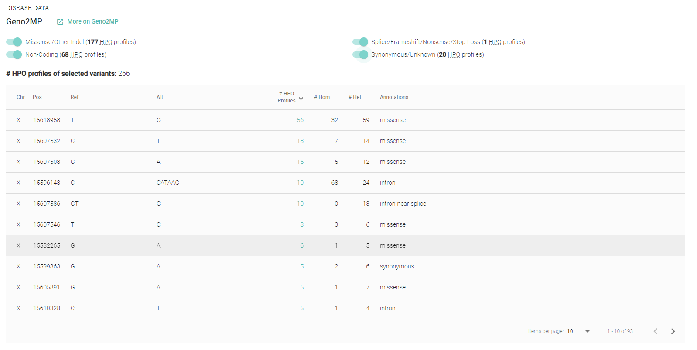

Additionally, the database provides information about expression of Ortholog Genes of *ACE2* and your gene ontology terms:

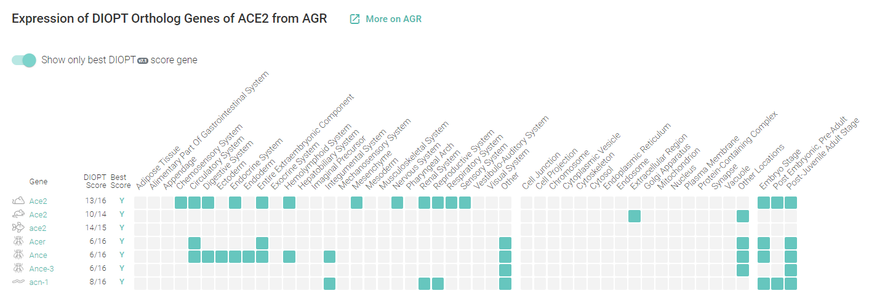
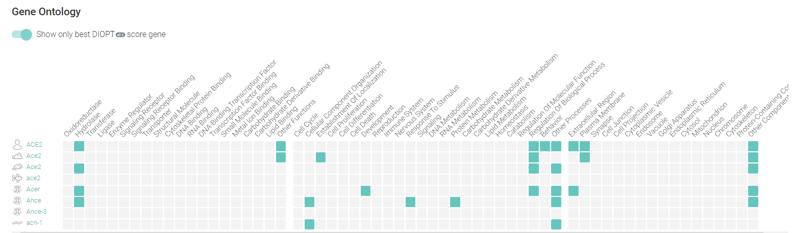
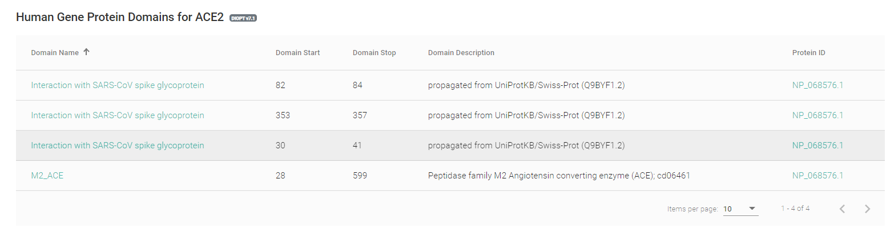

The two used variant-disease databases are complementary and user-friendly.

## Step 12: Proteome databases

## Step 13: Other databases

# Complete list of databases:

# Alternative splicing databases

**Database** |                  **URL**                                      |  
AltExtron    | <http://bioinformatics.org.au/tools/altExtron/>               |
AS-ALPS      | <http://as-alps.nagahama-i-bio.ac.jp/index.php>               |  
ASpedia      | <http://combio.snu.ac.kr/aspedia/index.html>                  |   
ASPicDB      | <http://srv00.recas.ba.infn.it/ASPicDB/>                      |  
BrainRNA-seq | <https://www.brainrnaseq.org/>                                |  
DBASS        | <http://www.dbass.org.uk/>                                    |          
FAST DB      | <http://www.genosplice.com/alternative-splicing>              |
FLJ DB       | <http://flj.lifesciencedb.jp/top/>                            |
H-DBAS       | <http://www.h-invitational.jp/h-dbas/>                        |
HEXEvent     | <http://hexevent.mmg.uci.edu/cgi-bin/HEXEvent/HEXEventWEB.cgi>|
HOLLYWOOD    | <http://hollywood.mit.edu/hollywood/Login.php>                |
HSF          | <http://www.umd.be/HSF3/index.html>                           |
IntSplice    | <https://www.med.nagoya-u.ac.jp/neurogenetics/IntSplice/>     |
MiasDB       | <http://47.88.84.236/Miasdb/index.php>                        |
NetGene2     | <http://www.cbs.dtu.dk/services/NetGene2/>                    |
NetUTR       | <http://www.cbs.dtu.dk/services/NetUTR/>                      |
SplicePort   | <http://spliceport.cbcb.umd.edu/>                             |
SpliceProt   | <http://bioinfoteam.fiocruz.br/spliceprot/index.php>          |
TassDB       | <http://tassdb2.leibniz-fli.de/>                              |

# Cancer databases

**Database** |                  **URL**                                                      |  
arrayMap     | <https://arraymap.org/>                                                       |
CGAProject   | <https://mitelmandatabase.isb-cgc.org/>                                       |
CancerNet    | <http://bis.zju.edu.cn/CancerNet/>                                            |
CanGEM       | <http://www.cangem.org/>                                                      |
CanProVar    | <http://canprovar.zhang-lab.org/index.php>                                    |
CARGO        | <http://cargo2.bioinfo.cnio.es/>                                              |
CCLE         | <https://portals.broadinstitute.org/ccle>                                     |
CGMD         | <http://cgmd.in/>                                                             |
ChiTaRS      | <http://chitars.md.biu.ac.il/>                                                |
COSMIC       | <https://cancer.sanger.ac.uk/cosmic>                                          |
CPDB         | <https://www.library.ucdavis.edu/database/carcinogenic-potency-database-cpdb/>|
DBCAT        | <http://dbcat.cgm.ntu.edu.tw/>                                                |
DbDEMC       | <https://www.picb.ac.cn/dbDEMC/>                                              |
dbDEPC       | <https://www.scbit.org/dbdepc3/index.php>                                     |
DiseaseMeth  | <http://bio-bigdata.hrbmu.edu.cn/diseasemeth/>                                |
DriverDB     | <http://120.110.158.132:8787/driverdbv2/cancer.php>                           |
GEMiCCL      | <https://www.kobic.kr/GEMICCL/>                                               |
GeneHub-GEPIS| <http://www.cgl.ucsf.edu/Research/genentech/genehub-gepis/>                   |
GSR          | <https://popmodels.cancercontrol.cancer.gov/gsr/>                             |
HCMDB        | <http://hcmdb.i-sanger.com/index>                                             |
HNOCDB       | <http://gyanxet.com/hno.html>                                                 |
ISOexpresso  | <http://wiki.tgilab.org/ISOexpresso/main.php?cat=about>                       |
MCF10A       | <https://carcinogenome.org/MCF10A/>                                           |
MERAV        | <http://merav.wi.mit.edu/>                                                    |
MethmiRbase  |<https://madlab.cpe.ku.ac.th/TR2/?itemID=108747>                               |
MGDB         |<http://bioinfo.ahu.edu.cn:8080/Melanoma/>                                     |
MiRCancer    |<http://mircancer.ecu.edu/>                                                    |
MiTranscript |<http://mitranscriptome.org/>                                                  |
MSGene       |<http://msgene.bioinfo-minzhao.org/>                                           |
MTCTScan     |<http://mulinlab.org/mtctscan>                                                 |
NCI ALMANAC  |<https://dtp.cancer.gov/ncialmanac/initializePage.do>                          |
NeXtProt     |<https://www.nextprot.org/about/nextprot>                                      |
OncoDB.HCC   |<http://oncodb.hcc.ibms.sinica.edu.tw/index.htm>                               |
OncomiRdbB   |<http://tdb.ccmb.res.in/OncomiRdbB/index.htm>                                  |
Oncoyeasti   |<http://www.oncoyeasti.org/>                                                   |
Pedican      |<http://pedican.bioinfo-minzhao.org/>                                          |
Progenetix   |<https://www.progenetix.org/>                                                  |
S-MED        |<https://www.oncomir.umn.edu/SMED/basic_search.php>                            |
SelTarbase   |<http://www.seltarbase.org/>                                                   |
TANTIGEN     |<http://projects.met-hilab.org/tadb/>                                          | 
TCGA Portal  |<https://www.cancer.gov/>                                                      |
TCRex        |<https://tcrex.biodatamining.be/instructions/>                                 |
UMDTP53db    |<http://www.umd.be:2072/>                                                      |

# Comparative databases

**Database** |                  **URL**                                                                               |
EVOG         |<http://neobio.cs.pusan.ac.kr/evog/>                                                                    |
GALA         |<http://gala.bx.psu.edu/>                                                                               |
GMO          |<http://gametsonline.nwsuaflmz.com/gene%20search.php>                                                   |
Gene Set     |<http://www.cisreg.ca/gsb/>                                                                             |
HelmCoP      |<http://www.nematode.net/helmcop.html>                                                                  |
Homophila    |<https://www.aminer.cn/pub/53e9bad0b7602d97046fde08/homophila-human-disease-gene-cognates-in-drosophila>|
Idiographica |<http://rtools.cbrc.jp/idiographica/>                                                                   |
IRView       |<http://ir.hgc.jp/>                                                                                     |
LMPD         |<http://www.lipidmaps.org/>                                                                             |
MANTEIA      |<http://manteia.igbmc.fr/gene-expression-search.php>                                                    |
MDWeb        |<http://mmb.irbbarcelona.org/MDWeb2/>                                                                   |
Metab2MeSH   |<http://sartorlab.ccmb.med.umich.edu/node/5>                                                            |
MGC          |<https://genecollections.nci.nih.gov/MGC/>                                                              |
Netview      |<http://netview.tigem.it/netview_project/netview_tools.html>                                            |
NHPRTR       |<http://nhprtr.org/resources.html>                                                                      |
NRED         |<http://jsm-research.imb.uq.edu.au/NRED>                                                                |
OpenDOAR     |<http://v2.sherpa.ac.uk/opendoar/>                                                                      |
PhenoHM      |<https://phenome.cchmc.org/phenoBrowser/Phenome>                                                        | 
POMO         |<https://ruoho.uta.fi/wp/pomo/>|                                                                        |
POEDB        |<https://giladlab.uchicago.edu/orthoExon/>                                                              |  
RasMol       |<http://www.bernstein-plus-sons.com/software/rasmol/>                                                   |
ReCGiP       |<http://klab.sjtu.edu.cn/ReCGiP/>                                                                       |
SQUAT        |<http://bsmc.insa-lyon.fr/squat/>                                                                       |
StemMapper   |<http://stemmapper.sysbiolab.eu/>                                                                       |
TiSGeD       |<http://bioinf.xmu.edu.cn:8080/databases/TiSGeD/index.html>                                             |
TISSUES      |<https://tissues.jensenlab.org/Search>                                                                  |
ToppCluster  |<https://toppcluster.cchmc.org/>                                                                        | 
TBrowser     |<http://tagc.univ-mrs.fr/tbrowser/>                                                                     |
tRFdb        |<http://genome.bioch.virginia.edu/trfdb/>                                                               |
Vega Browser |<http://vega.archive.ensembl.org/index.html>                                                            |
VISTA Browser|<https://enhancer.lbl.gov/frnt_page_n.shtml>                                                            |

# Disease-specific and variant-disease association

**Database** |                  **URL**                                                                               |
GlobinServer |<http://globin.cse.psu.edu>                                                                             |
AutDB        |<http://autism.mindspec.org/autdb/Welcome.do>                                                           |
BioAfrica    |<https://www.krisp.org.za/tools.php>                                                                    |
C/VD         |<http://www.padb.org/cvd/index.html>                                                                    |
ClinVar      |<https://www.ncbi.nlm.nih.gov/clinvar/>                                                                 |
DbDNV        |<http://goods.ibms.sinica.edu.tw/DNVs/>                                                                 |
DbGaP        |<https://www.ncbi.nlm.nih.gov/gap/>                                                                     |
dbSNP        |<http://www.ncbi.nlm.nih.gov/SNP>                                                                       |
DECIPHER     |<https://decipher.sanger.ac.uk/>                                                                        |
Denovo-db    |<http://denovo-db.gs.washington.edu/denovo-db/>                                                         |
DGV          |<http://dgv.tcag.ca/>                                                                                   |
Ageing Atlas |<http://ageing-map.org/>                                                                                |
Diseasome    |<http://www.kobic.kr/diseasome/>                                                                        |
DisGeNET     |<https://www.disgenet.org/>                                                                             |
DMDM         |<http://bioinf.umbc.edu/dmdm/>                                                                          |
EGA          |<https://www.ebi.ac.uk/ega/>                                                                            |
GeneReviews  |<https://www.uniprot.org/database/DB-0188>                                                              |
HbVar        |<http://globin.cse.psu.edu/hbvar/menu.html>                                                             |
HGMD         |<http://www.hgmd.cf.ac.uk/ac/index.php>                                                                 |
HGSVP        |<https://www.internationalgenome.org/human-genome-structural-variation-consortium/>                     |
HGV&TB       |<http://genome.igib.res.in/hgvtb/index.html>                                                            |
HMDD         |<http://www.cuilab.cn/hmdd>                                                                             |
HPO          |<https://hpo.jax.org/app/>                                                                              |
Hu.MAP       |<http://hu.proteincomplexes.org/>                                                                       |
HUMSAVAR     |<https://www.uniprot.org/docs/humsavar>                                                                 |
InvFEST      |<http://invfestdb.uab.cat/>                                                                             |
IonChannelsdb|<https://www.nextprot.org/portals/navmut>                                                               |
ITHANET      |<https://www.ithanet.eu/db/ithagenes>                                                                   |
Kaviar       |<http://db.systemsbiology.net/kaviar/cgi-pub/Kaviar.pl>                                                 |
KMeyeDB      |<http://mutationview.jp/MutationView/jsp/index.jsp>                                                     |
LaforaDB     |<http://projects.tcag.ca/lafora/>                                                                       |
LongevityMap |<http://genomics.senescence.info/longevity/>                                                            |
LOVD         |<http://www.lovd.nl/>                                                                                   |
LSDBs        |<https://grenada.lumc.nl/LSDB_list/lsdbs>                                                               |
MARRVEL      |<http://marrvel.org/>                                                                                   |
MelanomaMine |<http://melanomamine.bioinfo.cnio.es/>                                                                  |
Mutalyzer    |<https://mutalyzer.nl/>                                                                                 |
MutPred      |<http://mutpred.mutdb.org/>                                                                             |
NetChop      |<http://www.cbs.dtu.dk/services/NetChop/>                                                               |
OMIM         |<https://omim.org/>                                                                                     |
PAHKB        |<https://bioinfo.uth.edu/PAHKB/>                                                                        |
PanelApp     |<https://panelapp.genomicsengland.co.uk/>                                                               |
PaPI         |<http://papi.unipv.it/>                                                                                 |
PharmGKB     |<https://www.pharmgkb.org/>                                                                             |
Phenocarta   |<https://gemma.msl.ubc.ca/expressionExperiment/showAllExpressionExperiments.html>                       |
PhenoCHF     |<http://www.nactem.ac.uk/PhenoCHF/>                                                                     |
PhenoDB      |<https://researchphenodb.net/>                                                                          |
PhenoDigm    |<https://www.sanger.ac.uk/science/tools/phenodigm>                                                      |
PhenoHM      |<https://phenome.cchmc.org/phenoBrowser/Phenome>                                                        |
Phenopedia   |<https://phgkb.cdc.gov/PHGKB/startPagePhenoPedia.action>                                                |
PhenoTips    |<https://phenotips.com/>                                                                                |
PhosphOrtho  |<http://www.phosphortholog.com/>                                                                        |
PolyPhen2    |<http://genetics.bwh.harvard.edu/pph2/>                                                                 |
PredictSNP2  |<http://loschmidt.chemi.muni.cz/predictsnp2/>                                                           |
Rat/InterMine|<http://ratmine.mcw.edu/ratmine/begin.do>                                                               |
RAvariome    |<http://www.h-invitational.jp/hinv/rav/>                                                                |
SNP2TFBS     |<https://ccg.epfl.ch/snp2tfbs/>                                                                         |
SNPDelScore  |<https://www.ncbi.nlm.nih.gov/research/snpdelscore/>                                                    |
SNPedia      |<https://www.snpedia.com/>                                                                              |
SNPeffect    |<https://snpeffect.switchlab.org/>                                                                      |
SNVBox       |<https://karchinlab.org/apps/appSnvBox.html>                                                            |
UGAHash      |<http://ugahash.uni-frankfurt.de/>                                                                      |
UMD-Predictor|<http://umd-predictor.eu/index.php>                                                                     |
VarSome      |<https://varsome.com/>                                                                                  |

#  Methylation databases

**Database** |                  **URL**                                                                               |
ANCOGeneDB   |<https://bioinfo.uth.edu/ancogenedb/>                                                                   |
BECon        |<https://redgar598.shinyapps.io/BECon/>                                                                 |
DBCAT        |<http://dbcat.cgm.ntu.edu.tw/>                                                                          |
DiseaseMeth  |<http://bio-bigdata.hrbmu.edu.cn/diseasemeth/>                                                          |
GED          |<http://gametsepi.nwsuaflmz.com/>                                                                       |
Geneimprint  |<http://www.geneimprint.com/site/home>                                                                  |
Lnc2Meth     |<http://bio-bigdata.hrbmu.edu.cn/Lnc2Meth/>                                                             |
MethHC       |<http://methhc.mbc.nctu.edu.tw/>                                                                        |
PhenoScanner |<http://www.phenoscanner.medschl.cam.ac.uk/>                                                            |
ROADMAP      |<https://egg2.wustl.edu/roadmap/web_portal/index.html>                                                  |
TCGA         |<https://www.cancer.gov/>                                                                               |

#  Gene expression databases

**Database** |                  **URL**                                                                               |
AgeFactDB    |<http://agefactdb.jenage.de/>                                                                           |
Allen Brain  |<https://alleninstitute.org/>                                                                           |
AllerGAtlas  |<http://biokb.ncpsb.org/AlleRGatlas/>                                                                   |
AltExtron    |<http://bioinformatics.org.au/tools/altExtron/>                                                         |
ANGIOGENES   |<http://angiogenes.uni-frankfurt.de/>                                                                   |
arrayMap     |<https://arraymap.org/>                                                                                 |
AS-ALPS      |<http://as-alps.nagahama-i-bio.ac.jp/index.php>                                                         |
ASMBrainBlood|<https://epigenetics.essex.ac.uk/ASMBrainBlood/>                                                        |
ASpedia      |<http://combio.snu.ac.kr/aspedia/index.html>                                                            |
Cellosaurus  |<https://web.expasy.org/cellosaurus/>                                                                   |
CHESS        |<http://ccb.jhu.edu/chess/>                                                                             |
Cistrome DB  |<http://dc2.cistrome.org/>                                                                              |
Cortecon     |<http://cortecon.neuralsci.org/>                                                                        |
CSPA         |<https://wlab.ethz.ch/surfaceome/>                                                                      |
CSTEA        |<http://comp-sysbio.org/cstea/>                                                                         |
CYCLONET     |<http://cyclonet.biouml.org/>                                                                           |
DAnCER       |<http://wodaklab.org/dancer/>                                                                           |
DASHR        |<http://dashr2.lisanwanglab.org/>                                                                       |
dbCRID       |<http://c1.accurascience.com/dbCRID/>                                                                   |
dbOrg        |<https://biodbnet-abcc.ncifcrf.gov/>                                                                    |
DisGeNET     |<https://www.disgenet.org/>                                                                             |
DRG TXome    |<https://bbs.utdallas.edu/painneurosciencelab/sensoryomics/drgtxome/>                                   |
EPConDB      |<http://www.cbil.upenn.edu/node/90>                                                                     |
ESCAPE       |<http://www.maayanlab.net/ESCAPE/>                                                                      |
ESTDAB       |<https://www.ebi.ac.uk/ipd/estdab/>                                                                     |
euL1db       |<http://eul1db.ircan.org/>                                                                              |
EuroDia      |<http://eurodia.vital-it.ch>                                                                            |
ExpEdit      |<https://bioinformatics.cineca.it/expedit/>                                                             |
EdgeExpress  |<https://fantom.gsc.riken.jp/4/edgeexpress/view/#5558263>                                               |
FARNA        |<https://www.cbrc.kaust.edu.sa/farna/?page=home>                                                        |
FLJ          |<http://flj.lifesciencedb.jp/top/>                                                                      |
GEMiCCL      |<https://www.kobic.kr/GEMICCL/>                                                                         |
GenAge       |<http://genomics.senescence.info/genes/>                                                                |
Genatlas     |<http://www.genatlas.org/>                                                                              |
GeneMicroglia|<http://shiny.maths.usyd.edu.au/Ellis/MicrogliaPlots>                                                   |
Globin Gene  |<http://globin.cse.psu.edu/>                                                                            |
GTEx         |<https://gtexportal.org/home/>                                                                          |
HAGR         |<http://genomics.senescence.info/index.php>                                                             |
HCMDB        |<http://hcmdb.i-sanger.com/index>                                                                       |
Healthspan   |<http://functional.domains/healthspan/>                                                                 |
Hembase      |<http://hembase.niddk.nih.gov>                                                                          |
HGDP         |<https://www.hagsc.org/hgdp/>                                                                           |
HipSci       |<http://www.hipsci.org/>                                                                                |
HIVed        |<http://hivlatency.erc.monash.edu/>                                                                     |
hmChIP       |<http://jilab.biostat.jhsph.edu/database/cgi-bin/hmChIP.pl>                                             |
HoTResDB     |<http://hotresdb.bu.edu/>                                                                               |
HPMR         |<http://www.receptome.org/>                                                                             |
HPRD         |<http://www.hprd.org/>                                                                                  |
HSF          |<http://www.umd.be/HSF3/index.html>                                                                     |
HuGENavigator|<https://phgkb.cdc.gov/PHGKB/hNHome.action>                                                             |
Human Erythroblast Maturation |<https://cellline.molbiol.ox.ac.uk/eryth/cgi-bin/HEM.cgi>                              |
IGRhCellID   |<http://igrcid.ibms.sinica.edu.tw/cgi-bin/index.cgi>                                                    |
Inner Ear Transcriptome |<https://www.tgen.org/patients/neurological-disorders/>                                      |
Intropolis   |<https://github.com/nellore/intropolis/blob/master/README.md>                                           |
Islet Regulome Browser |<http://www.isletregulome.com/isletregulome/>                                                 |
Isobase      |<http://cb.csail.mit.edu/cb/mna/isobase/>                                                               |
ISOexpresso  |<http://wiki.tgilab.org/ISOexpresso/main.php?cat=about>                                                 |
Linc2GO      |<http://www.bioinfo.tsinghua.edu.cn/~liuke/Linc2GO/index.html>                                          |
Liverbase    |<http://liverbase.hupo.org.cn/index2.jsp>                                                               |
MetaQuery    |<http://metaquery.docpollard.org/>                                                                      |
MGEx-Udb     |<http://resource.ibab.ac.in/MGEx-Udb/>                                                                  |
MiasDB       |<http://47.88.84.236/Miasdb/index.php>                                                                  |
microRNA body|<https://www.mirnabodymap.org/>                                                                         |
MitoAge      |<http://www.mitoage.info/>                                                                              |
MSGene       |<http://msgene.bioinfo-minzhao.org/>                                                                    |
NHGRI Project|<https://research.nhgri.nih.gov/microarray/index.shtml>                                                 |
NHPRTR       |<http://nhprtr.org/resources.html>                                                                      |
PhenoScanner |<http://www.phenoscanner.medschl.cam.ac.uk/>                                                            |
Primer Z     |<http://grch37.genepipe.ncgm.sinica.edu.tw/primerz/beginDesign.do>                                      |
QMEAN        |<https://swissmodel.expasy.org/qmean/>                                                                  |
REDIportal   |<http://srv00.recas.ba.infn.it/redidb/index.html>                                                       |
RefEx        |<https://refex.dbcls.jp/index.php?lang=en>                                                              |
RenalDB      |<http://renaldb.uni-frankfurt.de/>                                                                      |
Retina       |<http://retina.tigem.it/>                                                                               |
RNALocate    |<http://www.rna-society.org/rnalocate/>                                                                 |
scRNASeqDB   |<https://bioinfo.uth.edu/scrnaseqdb/>                                                                   |
SIEGE        |<http://pulm.bumc.bu.edu/siegeDB>                                                                       |
SIGNOR       |<https://signor.uniroma2.it/>                                                                           |
SpermBase    |<http://www.spermbase.org/Search.php>                                                                   |
The Matrisome|<http://matrisomeproject.mit.edu/>                                                                      |
TiGER        |<http://bioinfo.wilmer.jhu.edu/tiger/>                                                                  |
TISSUES      |<https://tissues.jensenlab.org/Search>                                                                  |
tRFdb        |<http://genome.bioch.virginia.edu/trfdb/>                                                               |
TRI_tool     |<https://www.vin.bg.ac.rs/180/tools/tfpred.php>                                                         |
TSEM         |<https://hood-price.isbscience.org/research/tsem/>                                                      |
WeGet        |<https://coexpression.cmbi.umcn.nl/>                                                                    |

# Genomic and sequence databases

**Database** |                  **URL**                                                                               |
             |                                                                                                        |
1000Genomes  |<http://www.internationalgenome.org/>                                                                   |
3DSNP        |<http://cbportal.org/3dsnp/>                                                                            |
3Omics       |<https://3omics.cmdm.tw/>                                                                               |
CatalogSTR   |<https://strider.online/>                                                                               |
Catalog of enhancers in hESCs  |<http://www.medical-epigenomics.org/papers/barakat2018/>                              |
ABS          |<https://www.crg.eu/en/programme/programmes-groups/bioinformatics-and-genomics >                        |
AceView      |<http://www.ncbi.nlm.nih.gov/IEB/Research/Acembly>                                                      |
ActiveDriverDB|<https://github.com/reimandlab/ActiveDriverDB/issues>                                                  |
Adsn         |<http://adsn.ddnetbio.com/>                                                                             |
AFND         |<http://www.allelefrequencies.net/>                                                                     |
AlloFinder   |<http://mdl.shsmu.edu.cn/ALF/>                                                                          |
AMAZONIA     |<http://amazonia.transcriptome.eu/>                                                                     |
AmtDB        |<https://amtdb.org/>                                                                                    |
ANCO-GeneDB  |<https://bioinfo.uth.edu/ancogenedb/>                                                                   |
Aneurysm DB  |<http://www.cuilab.cn/agd>                                                                              |
AVPpred      |<http://crdd.osdd.net/servers/avppred/>                                                                 |
BDO          |<http://bioportal.bioontology.org/ontologies/BDO>                                                       |
BECon        |<https://redgar598.shinyapps.io/BECon/>                                                                 |
BioGPS       |<http://biogps.org/>                                                                                    |
BrainScope   |<https://brainscope.lumc.nl/brainscope>                                                                 |
CADD         |<https://cadd.gs.washington.edu/>                                                                       |
CCB          |<https://cellcycle.renci.org/>                                                                          |
ChIPSummitDB |<http://summit.med.unideb.hu/summitdb/index.php>                                                        |
Chorogenome  |<https://hicexplorer.usegalaxy.eu/>                                                                     |
Cichlids     |<http://cichlids.biosci.gatech.edu/>                                                                    |
CITGeneDB    |<http://citgenedb.yubiolab.org>                                                                         |
CLIMA        |<http://bioinformatics.hsanmartino.it/clima2/>                                                          |
ClinicalTrials|<https://clinicaltrials.gov/>                                                                          |
ClinVar      |<https://www.ncbi.nlm.nih.gov/clinvar/>                                                                 |
ComiR        |<http://www.benoslab.pitt.edu/comir/>                                                                   |
CRUNCH       |<http://crunch.unibas.ch/crunch/>                                                                       |
cWords       |<http://servers.binf.ku.dk/cwords/>                                                                     |
dbDSM        |<http://bioinfo.ahu.edu.cn:8080/dbDSM/index.jsp>                                                        |
dbEMT        |<http://dbemt.bioinfo-minzhao.org/>                                                                     |
DBETH        |<www.hpppi.iicb.res.in/btox/ >                                                                          |
dbMAE        |<https://mae.hms.harvard.edu/>                                                                          |
dbNSFP       |<https://sites.google.com/site/jpopgen/dbNSFP>                                                          |
DisGeNET     |<https://www.disgenet.org/>                                                                             |
DO           |<https://disease-ontology.org/>                                                                         |
Doc2Hpo      |<https://impact2.dbmi.columbia.edu/doc2hpo/>                                                            |
E-RNAi       |<https://www.dkfz.de/signaling/e-rnai3/>                                                                |
EBI          |<https://www.ebi.ac.uk/>                                                                                |
eDGAR        |<http://edgar.biocomp.unibo.it/gene_disease_db/index.html>                                              |
EpiACDev     |<https://cotney.research.uchc.edu/data/>                                                                |
EpimiRBase   |<https://www.epimirbase.eu/>                                                                            |
Eponine      |<https://www.sanger.ac.uk/about/who-we-are>                                                             |
ExomeServer  |<https://evs.gs.washington.edu/EVS/>                                                                    |
FirstEF      |<http://rulai.cshl.org/tools/FirstEF/>                                                                  |
G2Cdb        |<http://www.genes2cognition.org>                                                                        |
GENCODE      |<https://www.gencodegenes.org/human/>                                                                   |
GenePAtlas   |<http://biocc.hrbmu.edu.cn/GPA/>                                                                        |
GeneSetBuildr|<http://www.cisreg.ca/gsb/>                                                                             |
Gene Wiki    |<http://en.wikipedia.org/wiki/Portal:Gene_Wiki>                                                         |
GeneCards    |<genecards.org/>                                                                                        |
Geneimprint  |<http://www.geneimprint.com/site/home>                                                                  |
GeneLoc      |<https://genecards.weizmann.ac.il/geneloc/about_new.shtml>                                              |
GeneMap      |<www.ncbi.nlm.nih.gov/genemap>                                                                          |
GUIDES       |<http://guides.sanjanalab.org/#/>                                                                       |
H-InvDB      |<http://www.h-invitational.jp/>                                                                         |
HADb         |<http://autophagy.lu/index.html>                                                                        |
Harmonizome  |<http://amp.pharm.mssm.edu/Harmonizome/>                                                                |
HERVd        |<https://herv.img.cas.cz/>                                                                              |
HExpoChem    |<http://www.cbs.dtu.dk/services/HExpoChem-1.0/>                                                         |
HGMD         |<http://www.hgmd.cf.ac.uk/ac/index.php>                                                                 |
HGNC         |<https://www.genenames.org>                                                                             |
hLGDB        |<http://lysosome.unipg.it/>                                                                             |
HMDAD        |<http://www.cuilab.cn/hmdad>                                                                            |
HMMER3       |<https://www.ebi.ac.uk/Tools/hmmer/>                                                                    |
HMP          |<https://portal.hmpdacc.org/>                                                                           |
HOMD         |<http://www.homd.org>                                                                                   |
HomzygMapper |<http://www.homozygositymapper.org/>                                                                    |
hORFeome Database|<http://horfdb.dfci.harvard.edu/>                                                                   |
HPO          |<https://hpo.jax.org/app/>                                                                              |
HSF          |<http://www.umd.be/HSF3/index.html>                                                                     |
HUMA         |<https://huma.rubi.ru.ac.za/>                                                                           |
HumCFS       |<https://webs.iiitd.edu.in/raghava/humcfs/index.html>                                                   |
HydPred      |<http://lishuyan.lzu.edu.cn/hydpred/>                                                                   |
HyperCLDB    |<http://bioinformatics.hsanmartino.it/hypercldb/>                                                       |
IDADE2       |<http://bass.uib.es/~jaume/IDADE2/https/index.html>                                                     |
IGSR         |<https://www.internationalgenome.org/1000-genomes-project-publications>                                 |
iLoc-Cell    |<http://www.jci-bioinfo.cn/iLoc-Hum>                                                                    |
IMGT         |<http://www.imgt.org/>                                                                                  |
integrated gene catalog|<http://meta.genomics.cn/meta/home>                                                           |
IntSplice    |<https://www.med.nagoya-u.ac.jp/neurogenetics/IntSplice/>                                               |
InvFEST      |<http://invfestdb.uab.cat/>                                                                             |
ITHANET      |<https://www.ithanet.eu/db/ithagenes>                                                                   |
Kaviar       |<http://db.systemsbiology.net/kaviar/cgi-pub/Kaviar.pl>                                                 |
lncRNAtor    |<http://lncrnator.ewha.ac.kr/>                                                                          |
MAHMI        |<http://mahmi.org/>                                                                                     |
MARome       |<http://196.1.114.46:8080/MARome/index>                                                                 |
MDWeb        |<http://mmb.irbbarcelona.org/MDWeb2/>                                                                   |
MEME Suite   |<http://meme-suite.org/>                                                                                |
Mendel,MD    |<https://mendelmd.org/>                                                                                 |
MetaQuery    |<http://metaquery.docpollard.org/>                                                                      |
MetaRanker   |<http://www.cbs.dtu.dk/services/MetaRanker/>                                                            |
microDoR     |<http://reprod.njmu.edu.cn/cgi-bin/microdor/index.py>                                                   |
miR2GO       |<http://compbio.uthsc.edu/miR2GO/home.php>                                                              |
mLASSO-Hum   |<http://bioinfo.eie.polyu.edu.hk/mLASSOHumServer/index.html>                                            |
MSEA         |<https://www.metaboanalyst.ca/>                                                                         |
mTCTScan     |<http://mulinlab.org/mtctscan>                                                                          |
mtDNA-Serve  |<https://mtdna-server.uibk.ac.at/index.html>                                                            |
Mutalyzer    |<https://mutalyzer.nl/>                                                                                 |
MutPred      |<http://mutpred.mutdb.org/>                                                                             |
NCBI         |<https://www.ncbi.nlm.nih.gov/>                                                                         |
NetChop      |<http://www.cbs.dtu.dk/services/NetChop/>                                                               |
NetGene2     |<http://www.cbs.dtu.dk/services/NetGene2/>                                                              |
NetNGlyc     |<http://www.cbs.dtu.dk/services/NetNGlyc/>                                                              |
Netview      |<http://netview.tigem.it/netview_project/netview_tools.html>                                            |
NGD          |<http://www.nencki-genomics.org>                                                                        |
NHGRI Project|<https://research.nhgri.nih.gov/microarray/index.shtml>                                                 |
NIF          |<https://neuinfo.org/>                                                                                  |
OKdb         |<http://okdb.appliedbioinfo.net/>                                                                       |
OMIM         |<https://omim.org/>                                                                                     |
OncoDB.HCC   |<http://oncodb.hcc.ibms.sinica.edu.tw/index.htm>                                                        |
ONTOAD       |<http://bioportal.bioontology.org/ontologies/ONTOAD>                                                    |
OpenTargets  |<https://www.targetvalidation.org/>                                                                     |
OrthoDisease |<http://orthodisease.sbc.su.se/cgi-bin/index.cgi>                                                       |
OsteoporosAtlas|<http://biokb.ncpsb.org/osteoporosis/index.php>                                                       |
OverGeneDB   |<http://overgenedb.amu.edu.pl>                                                                          |
PanelApp     |<https://panelapp.genomicsengland.co.uk/>                                                               |
PaPI         |<http://papi.unipv.it/>                                                                                 |
PathogenFinder|<https://cge.cbs.dtu.dk/services/PathogenFinder/>                                                      |
PDID         |<http://biomine.cs.vcu.edu/servers/PDID/index.php>                                                      |
PDZPepInt    |<http://modpepint.informatik.uni-freiburg.de/PDZPepInt/Input.jsp>                                       |
Pedican      |<http://pedican.bioinfo-minzhao.org/>                                                                   |
PepPSy       |<http://peppsy.genouest.org/query>                                                                      |
PGP          |<https://www.personalgenomes.org/>                                                                      |
PharmGKB     |<https://www.pharmgkb.org/>                                                                             |
PhenoHM      |<https://phenome.cchmc.org/phenoBrowser/Phenome>                                                        |
Phenolyzer   |<http://phenolyzer.wglab.org/>                                                                          |
PhenomicDB   |<https://en.wikipedia.org/wiki/PhenomicDB>                                                              |
Phenomizer   |<http://compbio.charite.de/phenomizer/>                                                                 |
PhenoScanner |<http://www.phenoscanner.medschl.cam.ac.uk/>                                                            |
PhenoTips    |<https://phenotips.com/>                                                                                |
Piphillin    |<http://piphillin.secondgenome.com/>                                                                    |
PolyPhen2    |<http://genetics.bwh.harvard.edu/pph2/>                                                                 |
PolySearch2  |<http://polysearch.cs.ualberta.ca/index>                                                                |
PredictSNP2  |<http://loschmidt.chemi.muni.cz/predictsnp2/>                                                           |
Progenetix   |<https://www.progenetix.org/>                                                                           |
ProteomicsDB |<https://www.proteomicsdb.org/proteomicsdb/#overview>                                                   |
ProteoRE     |<http://www.proteore.org/>                                                                              |
PRS          |<http://mrcieu.mrsoftware.org/PRS_atlas/>                                                               |
PubGene      |<https://www.pubgene.com/>                                                                              |
QMEAN        |<https://swissmodel.expasy.org/qmean/>                                                                  |
QTRG         |<https://geneticmedicine.weill.cornell.edu/genome>                                                      |
Quokka       |<http://quokka.erc.monash.edu/>                                                                         |
R spider     |<http://www.bioprofiling.de/gene_list.html>                                                             |
RAAR         |<http://www.lerner.ccf.org/cancerbio/heemers/RAAR/>                                                     |
RasMol       |<http://www.bernstein-plus-sons.com/software/rasmol/>                                                   |
RatMine      |<https://omictools.com/ratmine-tool>                                                                    |
REGene       |<http://regene.bioinfo-minzhao.org/>                                                                    |
RIDDLE       |<http://www.functionalnet.org/riddle/>                                                                  |
RSSsite      |<https://www.itb.cnr.it/rss/>                                                                           |
Saqqaqproject|<https://ancientgenome.dk/>                                                                             |
ScaPD        |<http://bioinfo.wilmer.jhu.edu/ScaPD/>                                                                  |
sciAI        |<https://sci.ai/>                                                                                       |
SEGEL        |<http://www.chengfeng.info/smoking_database.html>                                                       |
Semantic db  |<http://sbb.cellfinder.org/>                                                                            |
SNP2TFBS     |<https://ccg.epfl.ch/snp2tfbs/>                                                                         |
SNPDelScore  |<https://www.ncbi.nlm.nih.gov/research/snpdelscore/>                                                    |
SNPs GO      |<https://snps-and-go.biocomp.unibo.it/snps-and-go/index.html>                                           |
SPEED        |<https://speed2.sys-bio.net/>                                                                           |
SpindleP     |<http://www.cbs.dtu.dk/services/SpindleP/>                                                              |
StemCellNet  |<http://stemcellnet.sysbiolab.eu/>                                                                      |
StSNP        |<http://ilyinlab.org/StSNP/>                                                                            |
SubPhosPred  |<http://bioinfo.ncu.edu.cn/SubPhosPred.aspx>                                                            |
SugarBindDB  |<https://sugarbind.expasy.org/>                                                                         |
SURFY        |<http://wlab.ethz.ch/surfaceome/>                                                                       |
T1Dbase      |<http://www.t1dbase.org>                                                                                |
T2D-Db       |<http://t2ddb.ibab.ac.in>                                                                               |
TCGA Portal  |<https://www.cancer.gov/>                                                                               | 
UCSCGenBrowser|<https://genome.ucsc.edu/cgi-bin/hgGateway>                                                            |
UK10K        |<https://www.uk10k.org/>                                                                                |
UMD-Predictor|<http://umd-predictor.eu/index.php>                                                                     |
UniReD       |<http://bioinformatics.med.uoc.gr/unired/>                                                              |
VarSome      |<https://varsome.com/>                                                                                  |
VDJsolver    |<http://www.cbs.dtu.dk/services/VDJsolver/>                                                             |
Vega         |<http://vega.sanger.ac.uk>                                                                              |
Vega Browser |<http://vega.archive.ensembl.org/index.html>                                                            |
VeryGene     |<http://www.verygene.com>                                                                               |
VHLdb        |<http://vhldb.bio.unipd.it/>                                                                            |
Zikv-CDB     |<http://zikadb.cpqrr.fiocruz.br>                                                                        |

#  LncRNA and miRNA databases

**Database** |                  **URL**                                                                               |
ComiR        |<http://www.benoslab.pitt.edu/comir/>                                                                   |
DASHR        |<http://dashr2.lisanwanglab.org/>                                                                       |
dbDEMC       |<https://www.picb.ac.cn/dbDEMC/>                                                                        |
DES-ncRNA    |<https://www.cbrc.kaust.edu.sa/des_ncrna/>                                                              |
E-RNAi       |<https://www.dkfz.de/signaling/e-rnai3//>                                                               |
exoRBase     |<http://www.exoRBase.org>                                                                               |
ExprTargetDB |<http://www.scandb.org/apps/microrna/>                                                                  |
GED          |<http://gametsepi.nwsuaflmz.com/>                                                                       |
GenePerturbAtlas|<http://biocc.hrbmu.edu.cn/GPA/>                                                                     |
hLGDB        |<http://lysosome.unipg.it/>                                                                             |
HMDD         |<http://www.cuilab.cn/hmdd>                                                                             |
HumanViCe    |<http://gyanxet-beta.com/humanvice/>                                                                    |
IntmiR       |<https://www.rgcb.res.in/intmir/>                                                                       |
IRBase       |<http://mimirna.centenary.org.au/irfinder/database/>                                                    |
Lnc2Meth     |<http://bio-bigdata.hrbmu.edu.cn/Lnc2Meth/>                                                             |
LncATLAS     |<http://lncatlas.crg.eu/>                                                                               |
lnCeDB       |<http://gyanxet-beta.com/lncedb/>                                                                       |
LNCediting   |<http://bioinfo.life.hust.edu.cn/LNCediting/>                                                           |
LNCipedia    |<https://lncipedia.org/>                                                                                |
LncRBase     |<http://bicresources.jcbose.ac.in/zhumur/lncrbase/>                                                     |
lncRNASNP    |<http://bioinfo.life.hust.edu.cn/lncRNASNP#!/>                                                          |
lncRNAtor    |<http://lncrnator.ewha.ac.kr/>                                                                          |
LncRNAWiki   |<http://lncrna.big.ac.cn/index.php/Main_Page>                                                           |
lncRNome     |<http://genome.igib.res.in/lncRNome>                                                                    |
MethmiRbase  |<https://madlab.cpe.ku.ac.th/TR2/?itemID=108747>                                                        |
microDoR     |<http://reprod.njmu.edu.cn/cgi-bin/microdor/index.py>                                                   |
microRNA.org |<http://www.microrna.org/>                                                                              |
miR-EdiTar   |<http://microrna.osumc.edu/mireditar/>                                                                  |
miR2Disease  |<http://www.miR2Disease.org>                                                                            |
miR2GO       |<http://compbio.uthsc.edu/miR2GO/home.php>                                                              |
miRCancer    |<http://mircancer.ecu.edu/>                                                                             |
miRDB        |<http://mirdb.org/>                                                                                     |
mirDIP       |<http://ophid.utoronto.ca/mirDIP/>                                                                      |
miRGate      |<http://mirgate.bioinfo.cnio.es/miRGate/>                                                               |
miRGen       |<http://carolina.imis.athena-innovation.gr/diana_tools/web/index.php?r=mirgenv3>                        |
MirGeneDB    |<https://mirgenedb.org/>                                                                                |
miRNA TF loop|<https://rth.dk/resources/tfmirloop/>                                                                   |
miRNAMap     |<http://mirnamap.mbc.nctu.edu.tw/>                                                                      |
miRPathDB    |<https://mpd.bioinf.uni-sb.de/>                                                                         |
MirSNP       |<http://cmbi.bjmu.edu.cn/mirsnp>                                                                        |
miRvar       |<http://genome.igib.res.in/mirlovd>                                                                     |
miRWalk      |<http://mirwalk.umm.uni-heidelberg.de/>                                                                 |
PITA         |<https://genie.weizmann.ac.il/pubs/mir07/mir07_prediction.html>                                         |
Polymirts    |<http://compbio.uthsc.edu/miRSNP/>                                                                      |
PuTmiR       |<https://www.isical.ac.in/~bioinfo_miu/TF-miRNA/TF-miRNA.html>                                          |
RenalDB      |<http://renaldb.uni-frankfurt.de/>                                                                      |
S-MED        |<https://www.oncomir.umn.edu/SMED/basic_search.php>                                                     |
SlideBase    |<http://slidebase.binf.ku.dk/>                                                                          |
The lncRNA Db|<http://www.valadkhanlab.org/database>                                                                  |
TissueAtlas  |<https://ccb-web.cs.uni-saarland.de/tissueatlas/>                                                       |
TriplexRNA   |<https://triplexrna.org/>                                                                               |
TUMIR        |<http://www.ncrnalab.com/TUMIR/>                                                                        |
Vir-Mir db   |<http://alk.ibms.sinica.edu.tw/cgi-bin/miRNA/miRNA.cgi>                                                 |
                                                    

#  Metabolic and enzyme databases

**Database** |                  **URL**                                                                               |
1-CMDb       |<http://slsdb.manipal.edu/ocm/>                                                                         |
CIDeR        |<http://mips.helmholtz-muenchen.de/cider/>                                                              |
DESTAF       |<https://www.cbrc.kaust.edu.sa/destaf/>                                                                 |
dkNET        |<https://dknet.org//>                                                                                   |
HEMD         |<http://mdl.shsmu.edu.cn/HEMD/>                                                                         |
HEPATONET1   |<http://www.ebi.ac.uk/biomodels-main/MODEL1009150000>                                                   |
HMDB         |<https://hmdb.ca/>                                                                                      |
HumanCyc     |<https://humancyc.org/>                                                                                 |
Hupho        |<http://hupho.uniroma2.it/>                                                                             |
KinMap       |<http://www.kinhub.org/kinmap/>                                                                         |
metabolicMine|<https://www.humanmine.org/humanmine/begin.do>                                                          |
MSEA         |<https://www.metaboanalyst.ca/>                                                                         |
PeroxisomeDB |<http://www.peroxisomedb.org/>                                                                          |
PhosphPred   |<http://phosphopredict.erc.monash.edu/>                                                                 |
Piphillin    |<http://piphillin.secondgenome.com/>                                                                    |
R spider     |<http://www.bioprofiling.de/gene_list.html>                                                             |
RegenBase    |<http://regenbase.org/>                                                                                 |
TSEM         |<https://hood-price.isbscience.org/research/tsem/>                                                      |
VMH          |<https://vmh.life/>                                                                                     |

#  Proteome and protein-protein interaction databases

**Database** |                  **URL**                                                                               |
2D-PAGE      |<http://web.mpiib-berlin.mpg.de/cgi-bin/pdbs/2d-page/extern/index.cgi>                                  |
AMPAD Portal |<https://www.synapse.org/#!Synapse:syn2580853/wiki/409840>                                              |
BioCarta     |<http://www.biocarta.com/>                                                                              |
BRD	         |<https://brd.nci.nih.gov/brd/>                                                                          |
Calcium Gene |<http://cagedb.uhlenlab.org/>                                                                           |
CCInteractome|<http://interactome.dfci.harvard.edu/>                                                                  |
CIDeR        |<http://mips.helmholtz-muenchen.de/cider/>                                                              |
ComPPI       |<https://comppi.linkgroup.hu/>                                                                          |
dbDEPC	     |<https://www.scbit.org/dbdepc3/index.php>                                                               |
Degradome db |<http://degradome.uniovi.es/>                                                                           |
DenHunt	     |<http://proline.biochem.iisc.ernet.in/DenHunt/about_database.php>                                       |
DEPhOd       |<http://depod.bioss.uni-freiburg.de/>                                                                   |
DIIP         |<http://bioinfo.lab.mcgill.ca/resources/diip/>                                                          |
HADb         |<http://autophagy.lu/index.html>                                                                        |
HAPPI	       |<http://discovery.informatics.uab.edu/HAPPI/>                                                           |
HERVd 	     |<https://herv.img.cas.cz/>                                                                              |
HGPD	       |<https://hgpd.lifesciencedb.jp/cgi/>                                                                    |
HKUPP	       |<http://www.hkupp.org/>                                                                                 |
HMMER3 	     |<https://www.ebi.ac.uk/Tools/hmmer/>                                                                    |
HPID	       |<http://wilab.inha.ac.kr/hpid/webforms/intro.aspx>                                                      |
HuInteractome|<http://www.actrec.gov.in/>                                                                             |
Human PPI    |<https://gene.sfari.org/>                                                                               |
HumProteinpedia|<http://www.humanproteinpedia.org>                                                                    |
HumanNet     |<http://www.functionalnet.org/humannet/about.html>                                                      |
HuPho        |<http://hupho.uniroma2.it/index.php>                                                                    |
HuPI	       |<https://hupi.ircm.qc.ca/>                                                                              |
HuRI         |<http://www.interactome-atlas.org/>                                                                     |
HydPred      |<http://lishuyan.lzu.edu.cn/hydpred/>                                                                   |
HypoxiaDB    |<http://www.hypoxiadb.com/hypoxiadb.html>                                                               |
iLoc-Cell    |<http://www.jci-bioinfo.cn/iLoc-Hum>                                                                    |
Instruct     |<http://instruct.yulab.org/>                                                                            |
Integrated Interactions |<http://dcv.uhnres.utoronto.ca/iid/>                                                         |
InWeb_IM     |<https://www.intomics.com/inbio/map.html#search>                                                        |
KEGG PATHWAY |<https://www.kegg.jp/>                                                                                  |
KinMap       |<http://www.kinhub.org/kinmap/>                                                                         |
KinoNetworkX |<http://www.kinasenet.ca/>                                                                              |
KLIFS	       |<https://klifs.vu-compmedchem.nl/>                                                                      |
Labeledln    |<https://ftp.ncbi.nlm.nih.gov/pub/lu/LabeledIn/>                                                        |
Ligandbook   |<https://ligandbook.org>                                                                                |
Membranome   |<https://membranome.org/>                                                                               |
MiasDB	     |<http://47.88.84.236/Miasdb/index.php>                                                                  |
MitoP2	     |<http://www.mitop2.de/>                                                                                 |
mLASSO-Hum   |<http://bioinfo.eie.polyu.edu.hk/mLASSOHumServer/index.html>                                            |
NetNGlyc     |<http://www.cbs.dtu.dk/services/NetNGlyc/>                                                              |
neXtProt     |<https://www.nextprot.org/about/nextprot>                                                               |
PaPI 	       |<http://papi.unipv.it/>                                                                                 |
PCDq	       |<http://h-invitational.jp/hinv/pcdq/>                                                                   |
PDID         |<http://biomine.cs.vcu.edu/servers/PDID/index.php>                                                      |
PepSweetener |<https://glycoproteome.expasy.org/pepsweetener/app/>                                                    |
PhosphoPICK  |<http://bioinf.scmb.uq.edu.au/phosphopick/phosphopick>                                                  |
PhosphoPredict|<http://phosphopredict.erc.monash.edu/>                                                                |
PhosphOrtholog|<http://www.phosphortholog.com/>                                                                       |
PIPs 	       |<http://www.compbio.dundee.ac.uk/www-pips/index.jsp>                                                    |
PrePPI	     |<https://bhapp.c2b2.columbia.edu/PrePPI/index.html>                                                     |
ProKinO	     |<http://vulcan.cs.uga.edu/prokino/about/browser>                                                        |
ProteomicsDB |<https://www.proteomicsdb.org/>                                                                         |
Quokka       |<http://quokka.erc.monash.edu/>                                                                         |
RasMol       |<http://www.bernstein-plus-sons.com/software/rasmol/>                                                   |
ScaPD 	     |<http://bioinfo.wilmer.jhu.edu/ScaPD/>                                                                  |
SMPDB	       |<https://smpdb.ca/view/SMP0000179>                                                                      |
SpindleP     |<http://www.cbs.dtu.dk/services/SpindleP/>                                                              |
StSNP        |<http://ilyinlab.org/StSNP/>                                                                            |
SubPhosPred  |<http://bioinfo.ncu.edu.cn/SubPhosPred.aspx>                                                            |
SURFY 	     |<http://wlab.ethz.ch/surfaceome/>                                                                       |
The Proteomedb|<http://proteomebrowser.org/tpb/home.jspx>                                                             |
TissueNet    |<http://netbio.bgu.ac.il/tissuenet/>                                                                    |
TRI_tool     |<https://www.vin.bg.ac.rs/180/tools/tfpred.php>                                                         |
UniHI	       |<http://www.unihi.org/>                                                                                 |
VDJsolver    |<http://www.cbs.dtu.dk/services/VDJsolver/>                                                             |
  
# Regulatory databases

**Database** |                  **URL**                                                                               |
ChIPSummitDB |<http://summit.med.unideb.hu/summitdb/index.php>                                                        |
CREME 	     |<https://creme.dcode.org/>                                                                              |
CRUNCH       |<http://crunch.unibas.ch/crunch/>                                                                       |
FirstEF 	   |<http://rulai.cshl.org/tools/FirstEF/>                                                                  |
GlycoViewer  |<http://www.glycoviewer.babs.unsw.edu.au/>                                                              |
HERVd 	     |<https://herv.img.cas.cz/>                                                                              |
HumCFS       |<https://webs.iiitd.edu.in/raghava/humcfs/index.html>                                                   |
Interferome  |<http://interferome.its.monash.edu.au/interferome/home.jspx>                                            |
JASPAR 	     |<http://jaspar.genereg.net/>                                                                            |
MANTA	       |<http://manta.cmmt.ubc.ca/manta2/upload>                                                                |
MEME Suite   |<http://meme-suite.org/>                                                                                |
MET 	       |<http://veda.cs.uiuc.edu/MET/>                                                                          |
microDoR     |<http://reprod.njmu.edu.cn/cgi-bin/microdor/index.py>                                                   |
OsteosAtlas  |<http://biokb.ncpsb.org/osteoporosis/index.php>                                                         |
PReMod       |<http://genomequebec.mcgill.ca/PReMod>                                                                  |
SM-TF      	 |<http://zoulab.dalton.missouri.edu/SM-TF/>                                                              |
TcoF-DB	     |<https://tools.sschmeier.com/tcof/home/>                                                                |
TFBSbank	   |<http://tfbsbank.co.uk/>                                                                                |
TFClass      |<http://tfclass.bioinf.med.uni-goettingen.de/>                                                          |
TFCONES	     |<http://tfcones.fugu-sg.org/>                                                                           |
TFM-Explorer |<https://bioinfo.lifl.fr/TFM/>                                                                          |
TMREC      	 |<http://www.jianglab.cn/TMREC/>                                                                         |
TRANSFAC	   |<http://genexplain.com/transfac/>                                                                       |
TTSMI        |<http://ttsmi.bii.a-star.edu.sg/>                                                                       |

#  Other databases

**Database** |                  **URL**                                                                               |
AAgAtlas     |<http://biokb.ncpsb.org/aagatlas/>                                                                      |
CytReD	     |<http://www.cro-m.eu/CytReD/>                                                                           |
dbMHC	       |<https://ftp.ncbi.nlm.nih.gov/pub/mhc/mhc/Final%20Archive/>                                             |
Epipox	     |<http://imed.med.ucm.es/epipox/>                                                                        |
GADGET       |<http://gadget.biosci.gatech.edu>                                                                       |
GDA	         |<https://geneticassociationdb.nih.gov/>                                                                 |
GIANT        |<https://portals.broadinstitute.org/collaboration/giant/index.php/GIANT_consortium>                     |
Global Biobank Engine|<https://biobankengine.stanford.edu/>                                                           |
GuavaH       |<http://www.guavah.org/>                                                                                |
GUIDES       |<http://guides.sanjanalab.org/#/>                                                                       |
H2P2         |<http://h2p2.oit.duke.edu/H2P2Home/>                                                                    |
HLA-ADR	     |<http://www.allelefrequencies.net/hla-adr/>                                                             |
HLAsupE   	 |<http://www.immunoinformatics.net/HLAsupE/index.html>                                                   |
HPtaa        |<http://www.bioinfo.org.cn/hptaa/>                                                                      |
HyperCLDB    |<http://bioinformatics.hsanmartino.it/hypercldb/>                                                       |
IEDB         |<https://www.iedb.org/>                                                                                 |
iLoc-Cell	   |<http://www.jci-bioinfo.cn/iLoc-Hum>                                                                    |
IMGT	       |<http://www.imgt.org/>                                                                                  |
IPD-IMGT/HLA |<https://www.ebi.ac.uk/ipd/imgt/hla/>                                                                   |
IPD-MHC      |<https://www.ebi.ac.uk/ipd/mhc/>                                                                        |
LD Hub	     |<http://ldsc.broadinstitute.org/>                                                                       |
MARome 	     |<http://196.1.114.46:8080/MARome/index>                                                                 |
MetabolomicsGWAS|<http://metabolomics.helmholtz-muenchen.de/gwas/index.php>                                           |
MitoAge 	   |<http://www.mitoage.info/>                                                                              |
MNDR	       |<http://www.rna-society.org/mndr/>                                                                      | 
mtDNA-Server |<https://mtdna-server.uibk.ac.at/index.html>                                                            |
NetMHC-3.0   |<http://www.cbs.dtu.dk/services/NetMHC/>                                                                |
NetMHCIIpan  |<http://www.cbs.dtu.dk/services/NetMHCIIpan/>                                                           |
PathogenFind |<https://cge.cbs.dtu.dk/services/PathogenFinder/>                                                       |
PEPVAC 	     |<http://imed.med.ucm.es/PEPVAC/>                                                                        |
PhosphoPICK  |<http://bioinf.scmb.uq.edu.au/phosphopick/phosphopick>                                                  |
PolyDoms     |<https://polydoms.cchmc.org/polydoms/>                                                                  |
PolySearch2  |<http://polysearch.cs.ualberta.ca/index>                                                                |
PRS          |<http://mrcieu.mrsoftware.org/PRS_atlas/>                                                               |
Psmir	       |<http://bio-bigdata.hrbmu.edu.cn/Psmir/>                                                                |
ReCGiP       |<http://klab.sjtu.edu.cn/ReCGiP/>                                                                       |
SHOGoiN	     |<https://stemcellinformatics.org/>                                                                      |
SNPDelScore  |<https://www.ncbi.nlm.nih.gov/research/snpdelscore/>                                                    |
StemCellNet  |<http://stemcellnet.sysbiolab.eu/>                                                                      |
SWATHAtlas	 |<http://www.swathatlas.org/>                                                                            |
SysteMHCAtlas|<https://systemhcatlas.org/>                                                                            |
TCLP	       |<http://celllines.tron-mainz.de/>                                                                       |
TCRex 	     |<https://tcrex.biodatamining.be/instructions/>                                                          |
The SBT	     |<https://ftp.ncbi.nlm.nih.gov/pub/mhc/mhc/Final%20Archive/>                                             |
VaDE	       |<http://bmi-tokai.jp/VaDE/>                                                                             |

# For more informations, please visit our paper :)

