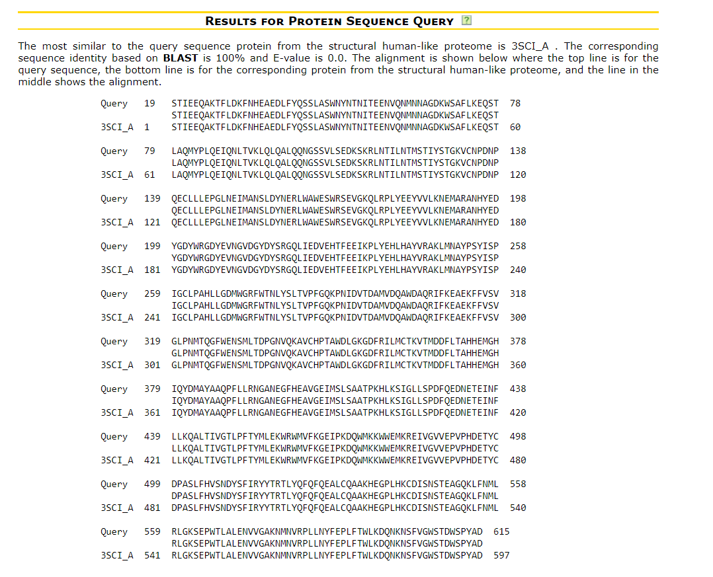
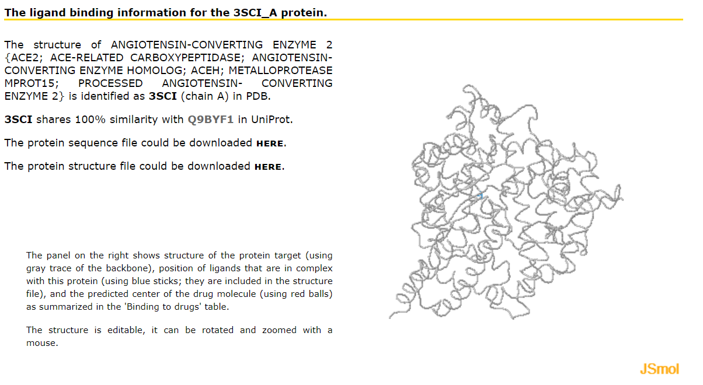
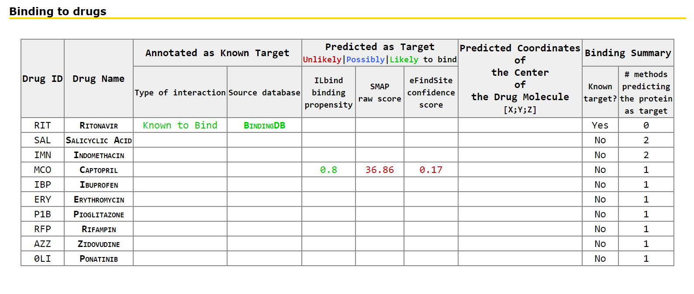
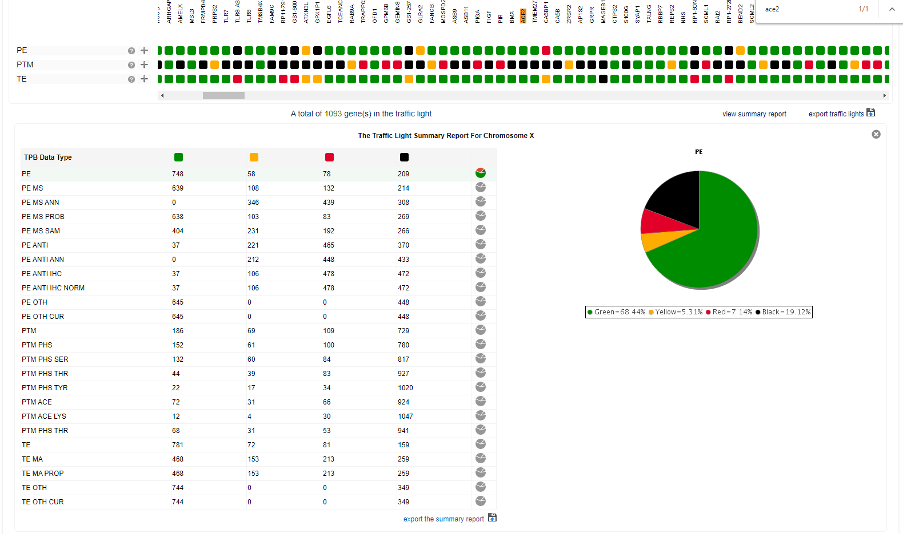

## Step 12 Proteome databases

First we use PDID: Protein-Drug Interaction Database in the structural human proteome. 

* Main page - explains the contents and how to use the main page of the PDID
* Results page for drug molecule - explains the page that provides summary of the results for a given drug
* Results page for protein target - explains the page that provides summary of the results for a given protein target
* Results page for protein sequence query - explains the page that provides summary of the results for the most similar to the query sequence protein from the structural human-like proteome

More informations and examples in <http://biomine.cs.vcu.edu/servers/PDID/help.html>

We search by protein sequence of *ACE2* with the Maximal E-value to filter BLAST output: 1e-3 (default).
Note: We search the .FASTA sequence in Uniprot, with the curated annotation <https://covid-19.uniprot.org/uniprotkb/Q9BYF1>

**Results page for protein target**
This page provides information concerning the known and putative protein-drug interactions for the selected protein target. This includes links to the corresponding protein sequence and structure files, visualization of the protein structure in complex with drugs that are known and that are predicted to bind the selected proteins, and tabulated detailed information concerning the known and putative protein-drug interactions. 

The drugs in the table are sorted by the likelihood that they interact with the selected proteins, starting with the drugs that are known to interact and following with the drugs predicted to interact, from higher to lower likelihood of interaction. Only the drugs that are known to interact or are predicted by at least one method to interact are included.

For other hand, The Proteome Browser (TPB) brings together data and information about human proteins from a number of sources and presents them in a gene- and chromosome-centric, interactive format. Member of the Human Proteome Organisation's (HUPO) Chromosome-centric Human Proteome Project (C-HPP), this resource is currently in phase 2 of development; hence several aspects are still in a draft version to demonstrate its potential and functionality. To view the interactive prototype report, select a chromosome from the drop down menu in the top right corner or below.
For our analysis, we select the Chromosome X and search by the *ACE2* gene.

* PE - Protein expression: Evidence for protein expression from MS- or antibody-based methods, or curated annotation. It is a summary of numerous underlying data types
Green: Strong evidence for expression at the protein level
Yellow: Probable expression at the protein level
Red: Dubious evidence for protein level expression, or strong evidence of transcript expression
Black: No evidence for protein expression is available

* PTM - Post-translational Modification: Evidence for post-translational modification of at least one gene product
Green: A protein product is post-translationally modified
Yellow: A protein product is probably post-translationally modified
Red: Poor/weak evidence for post-translationally modification of a protein product
Black: No evidence for post-translational modification is available

* TE - Transcript Expression: Evidence for biological expression of a RNA transcript
Green: Strong evidence for expression of a RNA transcript specifically from this gene
Yellow: Reasonably consistent evidence for RNA transcript expression, though not necessarily unique to this gene
Red: Poor or inconsistent evidence for RNA transcript expression from this gene
Black: No reasonable evidence for RNA expression from this gene is available

For the *ACE2*, Protein Expression was Strong evidence for expression at the protein level; no evidence for post-translational modification is available in the database, and strong evidence for expression of a RNA transcript specifically from this gene.

