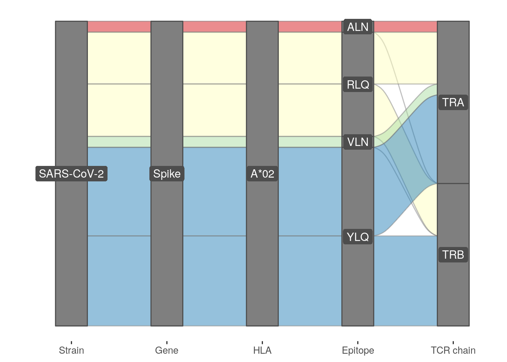
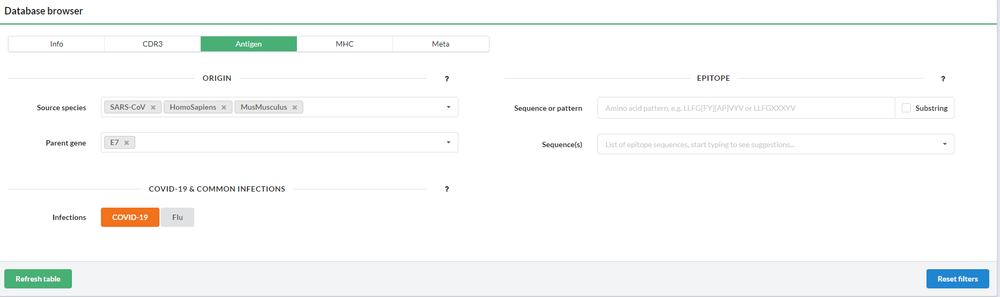
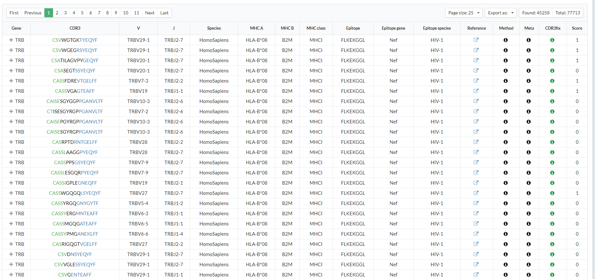

## Step 13 Other databases

In this section, we have databases about immunogenetic, CRISPR design experiments, workflow management tools and other biological databases.

We opted for use Semantic Body Browser - a tool for graphically exploring an organism's body. The tool has been developed as part of the CellFinder project. An integrated version can be found at <cellfinder.org/browse>. The Semantic Body Browser is a tool for graphically exploring an organism by means of ontologically annotated anatomical illustrations. The user can use with input organs, anatomical parts or cells of female and male human, and mouse. Considering the *ACE2* expression in Lung, we search initially for "lung" samples. The search return one result: lung from a human adult. The screen show a human body and the options: Entities and Heatmap. In the Heatmap option, we put the *ACE2* gene to verify the gene expression across the organs and tissues.

Here we use a human female with an example of search, in the collection "Human Bodymap 2.0". Gene expression was measuring by TPM (Transcripts per Million), when blue was 0.07 and yellow = 6.95. 

Trade the colletion into RNA seq Atlas data, we found several tissues with *ACE2* differentially expressed:

To compare the human female and male *ACE2* expression, we selected a human male body:

Switch the human to mouse, no information about Lung *ACE2* expression was found. 

The last database of our Case Study, VDJdb is a curated database of T-cell receptor (TCR) sequences with known antigen specificities. The primary goal of VDJdb is to facilitate access to existing information on T-cell receptor antigen specificities, i.e. the ability to recognize certain epitopes in a certain MHC contexts. Currently the VDJdb have SARS-COV2 informations. 

 

The table below shows VDJdb records, more information for each column contents is displayed when hovering over the column name.

Multiple records with the same TCR and antigen can be present if they come from different donors screened in the same study or different studies. The number of occurrences in samples and studies is listed in Meta column and reflected in confidence score.

In case a paired TCR chain (alpha or beta) is available for a given record, it can be fetched by clicking the plus sign to the left of the record.

The database can be searched using T-cell receptor (TCR), antigen, major histocompatibility complex (MHC) and record metadata field filters:

Click on the corresponding links above to select the filters.
Detailed information for each filter can be found by hovering over the question marks.
Use the buttons below to refresh the table or reset the filters.
Click on the column title to sort table
Filtered table can be exported as an TAB-delimited text file.

[INTRODUCTION](./index.md)     [Previous- Step 12](./page12.md)    [Next - Complete list of databases](./page14.md)
