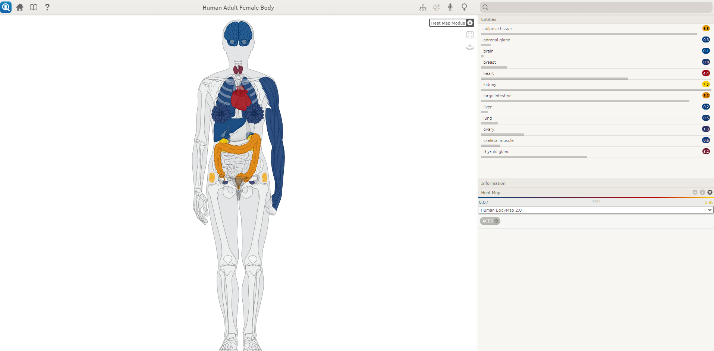

## Step 13 Other databases

In this section, we have databases about immunogenetic, CRISPR design experiments, workflow management tools and other biological databases.

We opted for use Semantic Body Browser - a tool for graphically exploring an organism's body. The tool has been developed as part of the CellFinder project. An integrated version can be found at cellfinder.org/browse. The Semantic Body Browser is a tool for graphically exploring an organism by means of ontologically annotated anatomical illustrations. The user can use with input organs, anatomical parts or cells of female and male human, and mouse. Considering the *ACE2* expression in Lung, we search initially for "lung" samples. The search return one result: lung from a human adult. The screen show a human body and the options: Entities and Heatmap. In the Heatmap option, we put the *ACE2* gene to verify the gene expression across the organs and tissues.

Here we use a human female with an example of search, in the collection "Human Bodymap 2.0". Gene expression was measuring by TPM (Transcripts per Million), when blue was 0.07 and yellow = 6.95. 

Trade the colletion into RNA seq Atlas data, we found several tissues with *ACE2* differentially expressed:

Switch the human to mouse, no information about Lung *ACE2* expression was found. To compare the human female and male *ACE2* expression, we selected a human male body:

