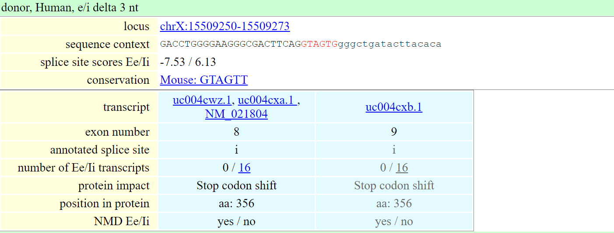

# Step 6 Alternative splicing databases

Here we explore the alternative forms of *ACE2*, first we search in ASPic DB. The gene results can be downloaded and the following output was shown: 

Aspic Results column show the gene information, Gene Structure View, Predicted Transcripts, Transcript Table, Predicted Proteins, Protein Table, Predicted Splice Sites and Intron Table.

 

The second alternative splicing database - TassDB	<http://tassdb2.leibniz-fli.de/>  is a database of alternative splice sites in mouse and human.
The user can enter a gene symbol (like ACE2) or a transcript ID (NM_001371415.1). The splice site scores are computed with MaxEntScan algorithm.
The result of the search consists of two parts: 

* a summary table listing the affected gene(s) and their number of tandem splice sites of each type
* detailed gene specific tables containing information regarding the individual tandem splice sites. 

In the image above, the red sequence is the tandem splice site as well as its exonic or intron flank is shown. Lower case letters represent intronic nucleotides, upper case letters are the exonic nucleotides.

These detailed result tables also provide links to the ESTs/mRNAs for both splice forms as well as links to the UCSC genome browser. 
Result details can be downloaded in csv table format (text, tab separated).
 
[INTRODUCTION](./index.md)  [Previous - Step 5](./page5.md) [Next - Step 7](./page7.md)
